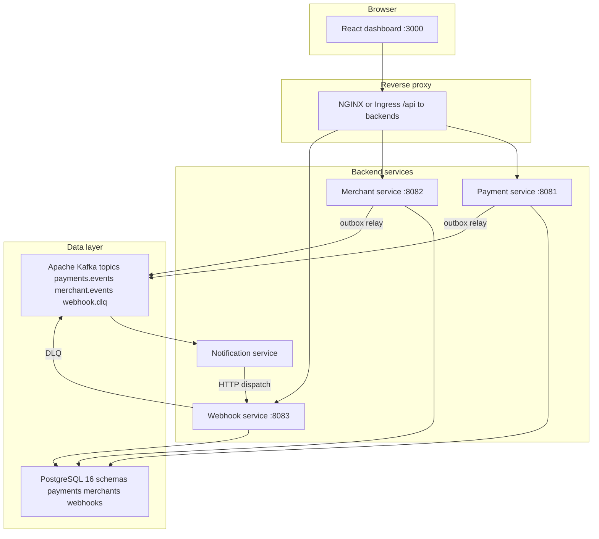

# PayFlow

Payment processing platform (portfolio). See [PayFlow_Specification.docx.txt](PayFlow_Specification.docx.txt) for the full technical specification.

## Architecture

In **Docker Compose**, the browser only talks to the frontend container; nginx there proxies `/api/*` to the three REST services. In **Kubernetes**, the Ingress routes to the frontend Service the same way.



## Quick start (Docker Compose)

Requires Docker Desktop (or compatible engine). From the repo root:

```bash
docker compose -f infra/docker-compose.yml up --build
```

Then open **http://localhost:3000** for the dashboard, **http://localhost:8080** for Kafka UI, and use the same API key flow as local dev ([PHASE6_REACT_FRONTEND.md](PHASE6_REACT_FRONTEND.md)).

Optional: copy [.env.example](.env.example) to `.env` and adjust ports or Postgres credentials.

## Prerequisites

- **Java 21** — [`.java-version`](.java-version) for [jenv](https://github.com/jenv/jenv): run `jenv local 21` in this directory if needed.
- **Node.js 20** — [`.nvmrc`](.nvmrc): `nvm install` then `nvm use`.
- **Docker** — for Testcontainers, Compose, and image builds.

## Backend

```bash
cd backend
./mvnw verify
```

## Frontend

```bash
cd frontend
npm ci
npm run lint
npm run test
npm run build
```

## Services and ports (local defaults)

| Service | Port | Role |
|---------|------|------|
| Frontend (Compose / nginx) | 3000 | SPA + `/api` proxy |
| Kafka UI | 8080 | Topic browser |
| payment-service | 8081 | Payments API |
| merchant-service | 8082 | Merchants API |
| webhook-service | 8083 | Webhooks API |
| notification-service | (internal) | Kafka consumer |
| PostgreSQL | 5432 | Single DB, Flyway schemas |
| Kafka | 9092 | Broker |

## Layout

```
payflow/
├── backend/           # Maven parent + payment, merchant, webhook, notification modules
├── frontend/          # React + Vite + TypeScript dashboard
├── infra/
│   ├── docker-compose.yml   # Local full stack
│   └── k8s/                 # Namespace, workloads, ingress (see PHASE7_INFRA_POLISH.md)
├── .github/workflows/ # CI: verify + GHCR image push on main
└── PHASE*.md          # Phase notes (domain through infra)
```

## Phase write-ups

- [PHASE7_INFRA_POLISH.md](PHASE7_INFRA_POLISH.md) — Compose, Kubernetes, CI/CD, deployment
- [PHASE6_REACT_FRONTEND.md](PHASE6_REACT_FRONTEND.md) — Dashboard, `/api` contract, testing
- [PHASE5_MERCHANT_SERVICE.md](PHASE5_MERCHANT_SERVICE.md) — Merchants and API keys
- [PHASE4_PAYMENT_SERVICE_REFUND_WEBHOOKSERVICE.md](PHASE4_PAYMENT_SERVICE_REFUND_WEBHOOKSERVICE.md)
- [PHASE_3_KAFKA_NOTI_SERVICE.md](PHASE_3_KAFKA_NOTI_SERVICE.md)
- [PHASE_2_PAYMENT_SERVICE.md](PHASE_2_PAYMENT_SERVICE.md)
- [PHASE_1_DOMAIN.md](PHASE_1_DOMAIN.md)
- [PHASE_0__IMPLEMENTATION.md](PHASE_0__IMPLEMENTATION.md) — older runbook snapshot
