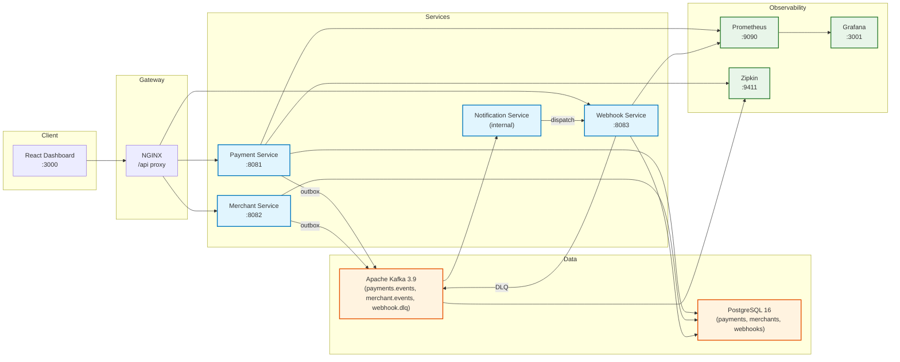

# PayFlow

A production-grade payment processing platform inspired by Stripe. PayFlow exposes a REST API that allows merchants to create payment intents, capture or cancel them, issue refunds, and receive asynchronous notifications via webhooks.

This project demonstrates **production-grade engineering practices**: Domain-Driven Design, Test-Driven Development, Hexagonal Architecture, containerized deployment with Docker and Kubernetes, and real-time event streaming with Apache Kafka.

## Features

### Payments
- Create, capture, cancel, and refund payments
- Automatic payment expiry for pending payments (Phase 13)
- Idempotency keys for safe retry (Phase 11)
- Full payment lifecycle with state machine

### Merchants
- Merchant registration and management
- BCrypt-hashed API keys
- API key rotation without race conditions (Phase 9)
- Cross-service API key cache for performance (Phase 12)

### Webhooks
- Register HTTPS webhook endpoints per merchant
- HMAC-SHA256 signed payloads
- Exponential backoff retry (5s → 30s → 2m → 10m → 1h)
- Dead letter queue for failed deliveries
- Built-in webhook receiver for local testing

### Observability (Phase 14)
- Prometheus metrics for all services
- Pre-configured Grafana dashboards
- Zipkin distributed tracing
- Custom metrics: payment counters, latency timers, webhook delivery stats

## Architecture


```mermaid
flowchart LR
    subgraph Client
        FE["React Dashboard\n:3000"]
    end

    subgraph Gateway
        NGINX["NGINX\n/api proxy"]
    end

    subgraph Services
        PS["Payment Service\n:8081"]
        MS["Merchant Service\n:8082"]
        WS["Webhook Service\n:8083"]
        NS["Notification Service\n(internal)"]
    end

    subgraph Data
        PG["PostgreSQL 16\n(payments, merchants, webhooks)"]
        KA["Apache Kafka 3.9\n(payments.events, merchant.events, webhook.dlq)"]
    end

    subgraph Observability
        PR["Prometheus\n:9090"]
        GR["Grafana\n:3001"]
        ZK["Zipkin\n:9411"]
    end

    FE --> NGINX
    NGINX --> PS
    NGINX --> MS
    NGINX --> WS
    PS --> PG
    MS --> PG
    WS --> PG
    PS -->|"outbox"| KA
    MS -->|"outbox"| KA
    KA --> NS
    NS -->|"dispatch"| WS
    WS -->|"DLQ"| KA
    PS --> PR
    WS --> PR
    PR --> GR
    PS --> ZK
    KA --> ZK

    classDef service fill:#e1f5fe,stroke:#0277bd,stroke-width:2px
    classDef data fill:#fff3e0,stroke:#e65100,stroke-width:2px
    classDef obs fill:#e8f5e9,stroke:#2e7d32,stroke-width:2px
    class PS,MS,WS,NS service
    class PG,KA data
    class PR,GR,ZK obs
```

### Technology Stack

| Component | Technology |
|-----------|------------|
| Language (Backend) | Java 21 (virtual threads) |
| Framework | Spring Boot 3.3 |
| Messaging | Apache Kafka 3.9 |
| Database | PostgreSQL 16 |
| Frontend | React 18 + TypeScript + Vite |
| UI Components | shadcn/ui + Tailwind CSS |
| Testing | JUnit 5 + Mockito + Testcontainers |
| Containerization | Docker + Docker Compose |

## Quick Start

### Prerequisites
- **Java 21** — [`.java-version`](.java-version) for jenv
- **Node.js 20** — [`.nvmrc`](.nvmrc)
- **Docker** — Docker Desktop or compatible engine

### Running the stack

```bash
cd infra
docker compose up --build
```

Then open:
- **http://localhost:3000** — Frontend dashboard
- **http://localhost:8080** — Kafka UI
- **http://localhost:9090** — Prometheus
- **http://localhost:3001** — Grafana (admin/admin)
- **http://localhost:9411** — Zipkin

### Running tests

**Backend:**
```bash
cd backend
./mvnw verify
```

**Frontend:**
```bash
cd frontend
npm ci
npm run lint
npm run test
npm run build
```

## API Overview

### Authentication

All API requests require an API key in the Authorization header:

```http
Authorization: Bearer sk_test_xxx
```

### Key Endpoints

| Method | Endpoint | Description |
|--------|----------|-------------|
| POST | `/v1/payments` | Create a payment intent |
| POST | `/v1/payments/:id/capture` | Capture a payment |
| POST | `/v1/payments/:id/cancel` | Cancel a payment |
| POST | `/v1/payments/:id/refunds` | Issue a refund |
| POST | `/v1/webhooks` | Register a webhook endpoint |
| POST | `/v1/merchants` | Register a new merchant |
| POST | `/v1/merchants/me/api-keys` | Rotate API key |

See [PayFlow_Specification_v2.md](PayFlow_Specification_v2.md) for the full API specification.

## Local Development

### Testing webhooks locally

PayFlow includes a built-in webhook receiver for testing:

1. Go to **http://localhost:3000/webhooks**
2. Register: `http://webhook-receiver:9000/webhook`
3. Select events (e.g., `payment.captured`)
4. Create and capture a payment

View received webhooks:
```bash
curl http://localhost:9000/webhooks
docker logs -f payflow-webhook-receiver-1
```

### Manual API testing

```bash
# Create merchant
curl -X POST http://localhost:8082/v1/merchants \
  -H "Content-Type: application/json" \
  -d '{"name":"TestShop","email":"test@test.com"}'

# Create payment
curl -X POST http://localhost:8081/v1/payments \
  -H "Authorization: Bearer sk_test_xxx" \
  -H "Content-Type: application/json" \
  -d '{"amount":10000,"currency":"USD","card":{"number":"4242424242424242","expMonth":12,"expYear":2027,"cvc":"123"}}'

# Capture payment
curl -X POST http://localhost:8081/v1/payments/pay_xxx/capture \
  -H "Authorization: Bearer sk_test_xxx"
```

## Services and Ports

| Service | Port | Description |
|---------|------|-------------|
| Frontend | 3000 | React dashboard + nginx proxy |
| Kafka UI | 8080 | Topic browser |
| payment-service | 8081 | Payments API |
| merchant-service | 8082 | Merchants API |
| webhook-service | 8083 | Webhooks API |
| webhook-receiver | 9000 | Local testing |
| PostgreSQL | 5432 | Single DB with schemas |
| Kafka | 9092 | Event streaming |
| Prometheus | 9090 | Metrics |
| Grafana | 3001 | Dashboards |
| Zipkin | 9411 | Tracing |

## Project Structure

```
payflow/
├── backend/                    # Java 21 + Spring Boot
│   ├── payment-service/       # Payment processing
│   ├── merchant-service/      # Merchant management
│   ├── webhook-service/       # Webhook delivery
│   └── notification-service/  # Kafka consumer
├── frontend/                  # React + TypeScript
├── webhook-receiver/          # Local testing server
├── infra/
│   ├── docker-compose.yml     # Full stack
│   ├── prometheus.yml         # Metrics config
│   ├── grafana/               # Dashboards
│   └── k8s/                   # Kubernetes manifests
├── .github/workflows/         # CI/CD
└── bruno/                     # API tests
```

## Phase Documentation

- [PHASE_14_OBSERVABILITY.md](PHASE_14_OBSERVABILITY.md) — Metrics, Prometheus, Grafana, Zipkin
- [PHASE_13_PAYMENT_EXPIRY_SCHEDULER.md](PHASE_13_PAYMENT_EXPIRY_SCHEDULER.md) — Automatic payment expiry
- [PHASE_12_CROSS_SERVICE_API_KEY_CACHE.md](PHASE_12_CROSS_SERVICE_API_KEY_CACHE.md) — Caffeine cache with Kafka invalidation
- [PHASE_11_IDEMPOTENCY.md](PHASE_11_IDEMPOTENCY.md) — Idempotency keys
- [PHASE_10_PAYMENT_CREATION_UI.md](PHASE_10_PAYMENT_CREATION_UI.md) — Frontend payment form
- [PHASE9_FIX_API_KEY_ROTATION.md](PHASE9_FIX_API_KEY_ROTATION.md) — API key rotation fix
- [PHASE8_UNIFY_API_KEY_AUTH.md](PHASE8_UNIFY_API_KEY_AUTH.md) — Unified authentication
- [PHASE7_INFRA_POLISH.md](PHASE7_INFRA_POLISH.md) — Docker, K8s, CI/CD
- [PHASE6_REACT_FRONTEND.md](PHASE6_REACT_FRONTEND.md) — React dashboard
- [PHASE4_PAYMENT_SERVICE_REFUND_WEBHOOKSERVICE.md](PHASE4_PAYMENT_SERVICE_REFUND_WEBHOOKSERVICE.md) — Refunds and webhooks
- [PHASE_3_KAFKA_NOTI_SERVICE.md](PHASE_3_KAFKA_NOTI_SERVICE.md) — Kafka integration
- [PHASE_2_PAYMENT_SERVICE.md](PHASE_2_PAYMENT_SERVICE.md) — Payment service
- [PHASE_1_DOMAIN.md](PHASE_1_DOMAIN.md) — Domain model

## Interview Talking Points

This project demonstrates:

- **DDD** — Rich aggregates, value objects, domain events
- **TDD** — Tests first, then implementation
- **Hexagonal Architecture** — Domain isolated from frameworks
- **Outbox Pattern** — Reliable event publishing without distributed transactions
- **Event-Driven Architecture** — Kafka for decoupling
- **Idempotency** — Safe retry for payment operations
- **Observability** — Metrics, tracing, dashboards
- **Rate Limiting** — Token bucket per API key (Phase 15)

See [PayFlow_Specification_v2.md](PayFlow_Specification_v2.md) for the full technical specification.