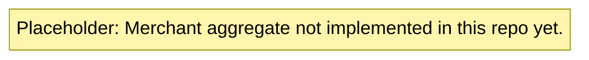

# merchant-service domain model

The **Merchants** bounded context is specified in [PayFlow_Specification.docx.txt](../../../../PayFlow_Specification.docx.txt) (Phase 5): merchant aggregate, API key hashing, lifecycle events on `merchant.events`.

This module is a **stub** (`com.payflow.merchant` package placeholder only). No `domain` package or aggregate types exist in the repository yet.

When implemented, expect under `com.payflow.merchant.domain`:

- **`Merchant`** aggregate: `MerchantId`, name, email, hashed API key, `createdAt`, `isActive`
- **Domain events** (spec): `MerchantCreatedEvent`, `MerchantDeactivatedEvent`
- **Rule:** persist API keys only as a **hash** (for example BCrypt)

