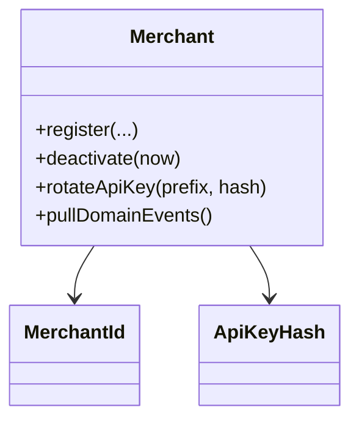

# merchant-service domain model

The **Merchants** bounded context is specified in [PayFlow_Specification.docx.txt](../../../../PayFlow_Specification.docx.txt) (Phase 5).

## Implemented types (`com.payflow.merchant.domain`)

- **`Merchant`** aggregate: `MerchantId`, name, email, `keyPrefix` (first 8 chars of raw API key for lookup), `ApiKeyHash` (BCrypt), `isActive`, `createdAt`, `deactivatedAt`
- **`MerchantId`** value object: `mer_` + UUID (no hyphens)
- **`ApiKeyHash`** value object: wraps persisted BCrypt string
- **Domain events:** `MerchantCreatedEvent`, `MerchantDeactivatedEvent`
- **Rules:** API keys are never stored in plaintext; only prefix + hash. `register`, `deactivate`, `rotateApiKey` enforce invariants.

## Application ports

- **`MerchantRepository`**, **`DomainEventOutbox`**, **`ApiKeyHasher`** (implemented in infrastructure with JPA + transactional outbox + BCrypt)

## Kafka

- Outbox publishes to **`merchant.events`** with envelope `eventType` `merchant.created` / `merchant.deactivated` and payload fields aligned with the spec.

