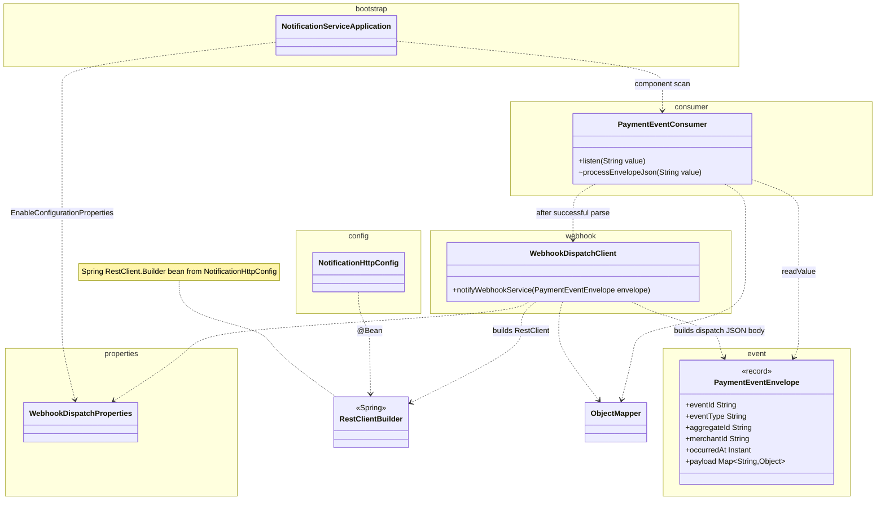

# notification-service class diagram

Kafka consumer on `payments.events`, JSON mapping to `PaymentEventEnvelope`, logging, and **HTTP dispatch** to webhook-service. Mermaid source; render in GitHub, GitLab, or an IDE Mermaid preview.

## Notes

- **Dependency** (`..>`): `PaymentEventConsumer` uses Jackson `ObjectMapper` and, on success, `WebhookDispatchClient`.
- **Entry point:** Spring Kafka invokes `PaymentEventConsumer.listen` via `@KafkaListener(topics = "payments.events", groupId = "notification-service")`.
- **`RestClient`:** Provided by Spring; `NotificationHttpConfig` exposes `RestClient.Builder` as a bean. The diagram uses `RestClientBuilder` as a label for that Spring type.
- **Tests** under `src/test/java/com/payflow/notification/` are omitted to keep the diagram small (`PaymentEventConsumerTest`, Kafka and WireMock integration tests).
