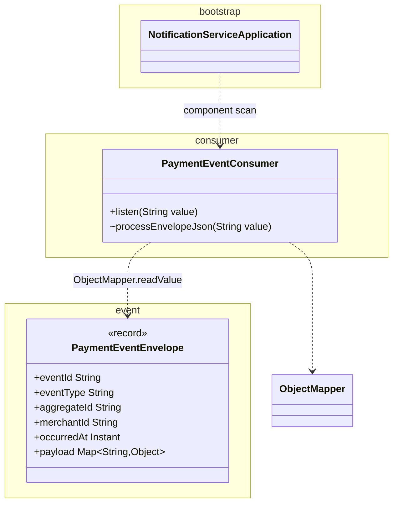

# notification-service class diagram

This service is a thin **Kafka subscriber** to `payments.events`: it deserializes the shared JSON envelope and logs at INFO. There is no persistence layer or REST API in this phase. Mermaid source; render in GitHub, GitLab, or an IDE Mermaid preview.

## Notes

- **Dependency** (`..>`): the consumer uses Jackson’s `ObjectMapper` and maps JSON into `PaymentEventEnvelope`.
- **Entry point:** Spring Kafka invokes `PaymentEventConsumer.listen` via `@KafkaListener(topics = "payments.events", groupId = "notification-service")`.
- **Tests** (`PaymentEventConsumerTest`, `NotificationConsumerIntegrationTest`) are omitted to keep the diagram small; they sit under `src/test/java/com/payflow/notification/`.
