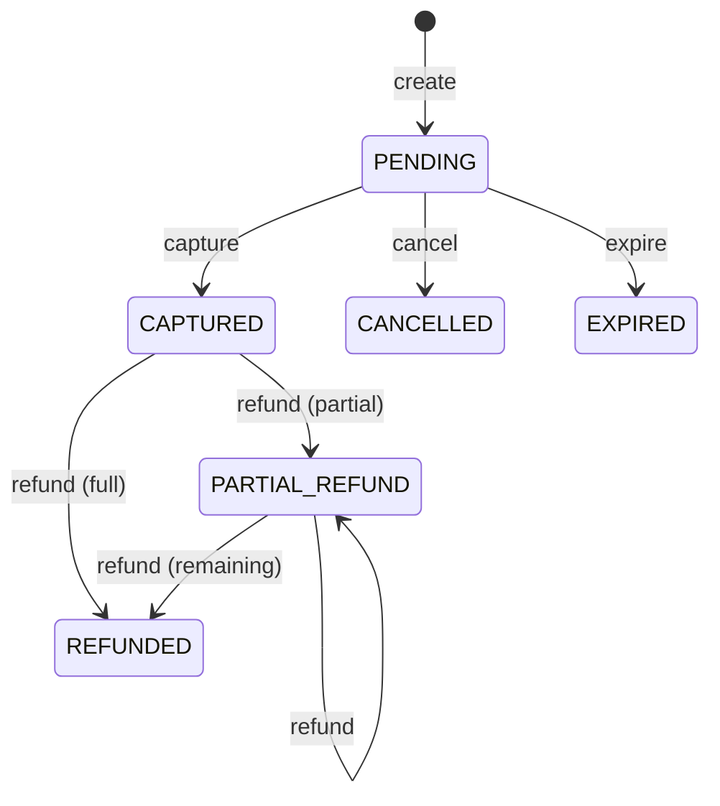

# payment-service domain model

`com.payflow.payment.domain` and `domain.event` / `domain.exception`: aggregate, value objects, enums, domain events, and domain exceptions. No application, API, or infrastructure types.

```mermaid
classDiagram
  direction TB

  class Payment <<aggregate root>> {
    +create(merchantId, amount, description, card, metadata, createdAt)
    +restore(...)
    +capture(now)
    +cancel(now, reason)
    +refund(refundAmount, now)
    +expire(now)
    +pullDomainEvents()
    +id() PaymentId
    +merchantId() MerchantId
    +amount() Money
    +cardDetails() CardDetails
    +status() PaymentStatus
    +metadata() Map
    +createdAt() Instant
    +expiresAt() Instant
  }

  class PaymentId <<value object>>
  class MerchantId <<value object>>
  class Money <<value object>>
  class CardDetails <<value object>>
  class RefundId <<value object>>
  class Refund <<line item>> {
    +id() RefundId
    +paymentId() PaymentId
    +amount() Money
    +reason() Optional~String~
    +createdAt() Instant
  }

  class PaymentStatus <<enumeration>>
  class CardBrand <<enumeration>>

  <<interface>> DomainEvent
  class PaymentCreatedEvent
  class PaymentCapturedEvent
  class PaymentCancelledEvent
  class PaymentRefundedEvent
  class PaymentExpiredEvent

  abstract class DomainException
  class InvalidStateTransitionException
  class InsufficientRefundableAmountException
  class InvalidCurrencyException
  class NegativeAmountException

  Payment *-- PaymentId
  Payment *-- MerchantId
  Payment *-- Money
  Payment *-- CardDetails
  Payment *-- PaymentStatus
  Payment o-- "0..*" DomainEvent : pending events

  Refund *-- RefundId
  Refund *-- PaymentId
  Refund *-- Money
  note for Refund "Persisted line item; not the aggregate root.\nCreated by application after Payment.refund()."

  CardDetails *-- CardBrand

  DomainEvent <|.. PaymentCreatedEvent
  DomainEvent <|.. PaymentCapturedEvent
  DomainEvent <|.. PaymentCancelledEvent
  DomainEvent <|.. PaymentRefundedEvent
  DomainEvent <|.. PaymentExpiredEvent

  PaymentCreatedEvent ..> PaymentId
  PaymentCreatedEvent ..> MerchantId
  PaymentCreatedEvent ..> Money
  PaymentCreatedEvent ..> PaymentStatus

  PaymentCapturedEvent ..> PaymentId
  PaymentCapturedEvent ..> MerchantId
  PaymentCapturedEvent ..> Money

  PaymentCancelledEvent ..> PaymentId
  PaymentCancelledEvent ..> MerchantId

  PaymentRefundedEvent ..> PaymentId
  PaymentRefundedEvent ..> MerchantId
  PaymentRefundedEvent ..> RefundId
  PaymentRefundedEvent ..> Money

  PaymentExpiredEvent ..> PaymentId
  PaymentExpiredEvent ..> MerchantId

  DomainException <|-- InvalidStateTransitionException
  DomainException <|-- InsufficientRefundableAmountException
  DomainException <|-- InvalidCurrencyException
  DomainException <|-- NegativeAmountException

  Money ..> InvalidCurrencyException : may throw
  Money ..> NegativeAmountException : may throw
  Payment ..> InvalidStateTransitionException : may throw
  Payment ..> InsufficientRefundableAmountException : may throw
```

## Lifecycle (reference)



## Event sketch

| Event | Typical trigger |
| --- | --- |
| `PaymentCreatedEvent` | `Payment.create` |
| `PaymentCapturedEvent` | `capture` |
| `PaymentCancelledEvent` | `cancel` |
| `PaymentRefundedEvent` | `refund` |
| `PaymentExpiredEvent` | `expire` |

The application layer drains `pullDomainEvents()` and appends to the transactional outbox; that wiring is outside the domain model.
