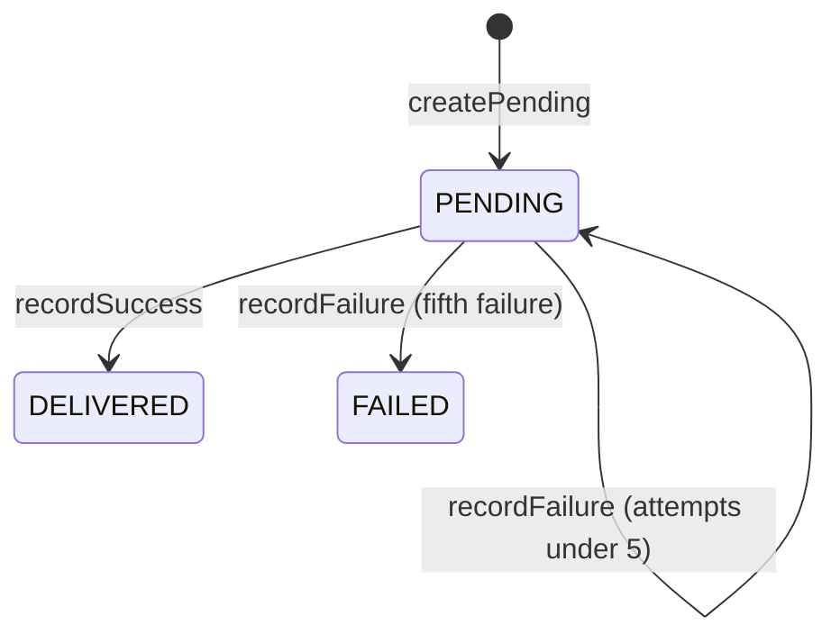

# webhook-service domain model

`com.payflow.webhook.domain`: aggregate, entities, value objects, enums, and domain exceptions. No Spring, JPA, Kafka, or HTTP types.

```mermaid
classDiagram
  direction TB

  class WebhookEndpoint <<aggregate root>> {
    +register(merchantId, url, eventTypes, now)
    +restore(...)
    +deactivate()
    +matchesEvent(eventType) boolean
    +id() WebhookId
    +merchantId() MerchantId
    +url() String
    +secret() String
    +eventTypes() Set~String~
    +active() boolean
    +createdAt() Instant
  }

  class WebhookDelivery <<entity>> {
    +createPending(webhookId, eventType, eventPayloadJson, now)
    +restore(...)
    +recordSuccess(now)
    +recordFailure(error, now)
    +isDue(now) boolean
    +id() WebhookDeliveryId
    +webhookId() WebhookId
    +eventType() String
    +eventPayloadJson() String
    +status() DeliveryStatus
    +attempts() int
    +lastAttemptAt() Instant
    +nextRetryAt() Instant
    +lastError() String
    +createdAt() Instant
  }

  class WebhookId <<value object>>
  class WebhookDeliveryId <<value object>>
  class MerchantId <<value object>>

  class DeliveryStatus <<enumeration>>

  abstract class DomainException
  class InvalidWebhookUrlException
  class MaxWebhookEndpointsExceededException

  WebhookEndpoint *-- WebhookId
  WebhookEndpoint *-- MerchantId
  WebhookEndpoint o-- "1..*" String : eventTypes

  WebhookDelivery *-- WebhookDeliveryId
  WebhookDelivery *-- WebhookId
  WebhookDelivery *-- DeliveryStatus

  WebhookDelivery ..> WebhookEndpoint : targets by webhookId

  DomainException <|-- InvalidWebhookUrlException
  DomainException <|-- MaxWebhookEndpointsExceededException

  WebhookEndpoint ..> InvalidWebhookUrlException : register
  note for WebhookEndpoint "Max 5 active endpoints per merchant enforced in application layer."
```

## Rules (reference)

| Rule | Where |
| --- | --- |
| Webhook URL must use `https://` | `WebhookEndpoint.register` |
| At least one event type on register | `WebhookEndpoint.register` |
| Max **5** active endpoints per merchant | `WebhookApplicationService.register` |
| Delivery retries: **5** attempts, backoff **5s, 30s, 2m, 10m, 1h** | `WebhookDelivery.recordFailure` |

## Delivery status



## Application-only exceptions

`WebhookNotFoundException` lives in `application.exception` (not domain): it signals a missing webhook for the authenticated merchant on list/deactivate/deliveries queries.
