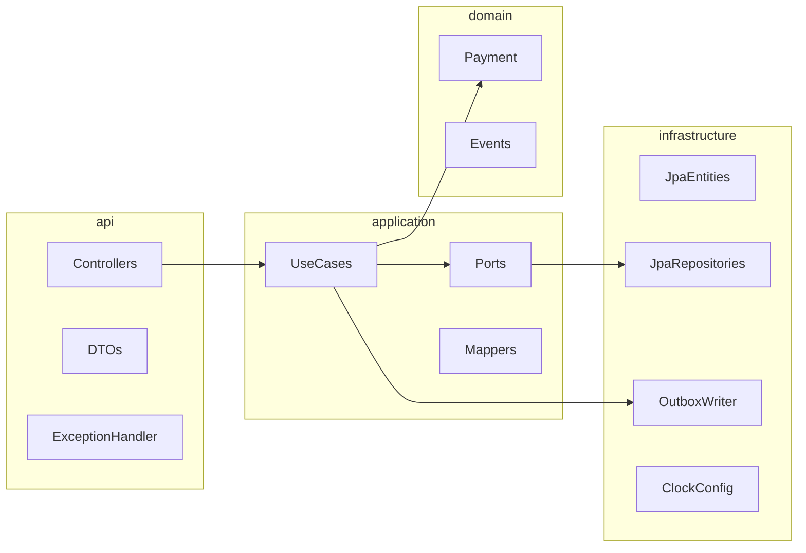

# Phase 2 — payment service implementation plan

## What the spec defines

From [PayFlow_Specification.docx.txt](PayFlow_Specification.docx.txt) **§11** and **§6**:

| Phase 2 deliverable                | Spec reference    |
| ---------------------------------- | ----------------- |
| Spring Boot app                    | §2.3, §8          |
| JPA repositories                   | §2.3              |
| REST: create / capture / cancel    | §11 Phase 2; §4.2 |
| Outbox table                       | §6.2              |
| Integration tests (Testcontainers) | §7.1, §7.3        |

**Explicitly out of scope for Phase 2** (later phases): Kafka outbox relay (**Phase 3**), refund HTTP API and webhook service (**Phase 4**), real merchant service + API key verification (**Phase 5**). The domain already supports refunds and expiry; persistence for **refunds** can wait until Phase 4 unless you want the DDL created early as an empty table.

---

## Current baseline

- [backend/payment-service](backend/payment-service): rich `[Payment](backend/payment-service/src/main/java/com/payflow/payment/domain/Payment.java)` aggregate, events, `pullDomainEvents()` — **no** Spring, **no** `src/main` application entrypoint.
- [backend/pom.xml](backend/pom.xml): Java 21, JUnit/AssertJ only; **no** Spring Boot BOM yet.
- [backend/payment-service/pom.xml](backend/payment-service/pom.xml): Jacoco **line/branch 100%** scoped to `com.payflow.payment.domain/`** only; Phase 2 will need a deliberate policy for new packages (see below).

---

## 1. Dependencies and module layout

- Add **Spring Boot 3.3.x** via BOM import (recommended on [backend/pom.xml](backend/pom.xml) `dependencyManagement`: `spring-boot-dependencies`) so merchant/webhook modules can reuse versions later.
- [payment-service/pom.xml](backend/payment-service/pom.xml): `spring-boot-starter-web`, `spring-boot-starter-data-jpa`, `postgresql` runtime, `spring-boot-starter-validation`, **Flyway** (no Liquibase/Flyway in repo today) for schema versioning.
- Test: `spring-boot-starter-test`, **Testcontainers** (JUnit 5 + PostgreSQL module). Optional: **WireMock** later for outbound calls; not required if acquiring is an in-process stub.
- Optional same-phase: **springdoc-openapi** for OpenAPI 3.1 per §2.3 (low cost; helps frontend in Phase 6).

---

## 2. Database schema (Flyway, `payments` schema)

Align with **§6.1** `payments` plus **§6.2** `outbox_events`:

- `**payments`**: columns as spec (`id`, `merchant_id`, `amount`, `currency`, `status`, `description`, `card_last4`, `card_brand`, `metadata` JSONB, timestamps including `expires_at`). Map `total_refunded` if you persist refund state in Phase 4; for Phase 2 you can either add `total_refunded NUMERIC(19,2) DEFAULT 0` now to match the aggregate, or add it in Phase 4 when refund API lands.
- `**client_secret` gap**: §4.2 says create returns `client_secret`; §6.1 DDL does not include it. **Recommendation**: add `client_secret VARCHAR(...)` (or similar) in Flyway and generate a random opaque value on create in the application layer so the API matches the spec without overloading the domain model (keep Phase 1 aggregate unchanged unless you explicitly want `client_secret` in domain).

Use a dedicated PostgreSQL schema for this bounded context (e.g. `payments`) per project rules; set `spring.jpa.properties.hibernate.default_schema` / Flyway `schemas` accordingly.

`**refunds` table (§6.1)**: defer to Phase 4 unless you want forward-compatible DDL with no code paths yet.

---

## 3. Hexagonal layering inside `payment-service`

Keep dependencies pointing inward; **domain** stays free of Spring/JPA.

- `**application**`: ports such as `PaymentRepository`, `OutboxEventRepository` (or single `UnitOfWork` that saves payment + outbox). Application services: create payment, get by id, list (optional), capture, cancel — each `@Transactional`.
- `**infrastructure**`: JPA entities + Spring Data repositories implementing ports; map entity ↔ `[Payment](backend/payment-service/src/main/java/com/payflow/payment/domain/Payment)` in a dedicated mapper (rehydrate aggregate from DB on load; on save, persist fields + drain `pullDomainEvents()` into outbox rows).
- `**api**`: REST controllers under `/v1/payments`, DTOs, validation; global handler for **§4.4** shape `{ "error": { "code", "message", "param?", "requestId" } }` with a generated `requestId` (MDC or `UUID`).

---

## 4. Transactional outbox (write path only)

- On every aggregate change, after `save`, take events from `pullDomainEvents()` and insert rows into `outbox_events` (`aggregate_id`, `event_type`, `payload` JSONB, `published = false`) **in the same transaction** as the payment row update.
- Serialize payloads to JSON compatible with **§5.3** event types you emit in Phase 2: at minimum `payment.created`, `payment.captured`, `payment.cancelled` (and `payment.expired` only if you expose a job or manual path in Phase 2; otherwise omit until needed).
- **Phase 3** will poll `published = false`; no publisher in Phase 2.

---

## 5. REST API scope for Phase 2

**Minimum per §11 Phase 2:**

- `POST /v1/payments` — body per §4.2; map stub card (`number`, `expMonth`, `expYear`, `cvc`) to `[CardDetails](backend/payment-service/src/main/java/com/payflow/payment/domain/CardDetails.java)` (last4 from PAN, brand from test BIN rules — **never** persist full PAN). Return `201` + PENDING + `client_secret` if you add the column.
- `POST /v1/payments/{id}/capture` — idempotent: if already `CAPTURED`, return `200` with same representation and **do not** append duplicate outbox events.
- `POST /v1/payments/{id}/cancel` — only from `PENDING`; map domain errors to 409/400 with stable `error.code` values.

**Strongly recommended in the same phase** (§4.2, §7.3): `GET /v1/payments/{id}` and `GET /v1/payments?page=&size=&status=` so integration tests and the future dashboard have read paths without a follow-up mini-phase. If you want strict minimalism, defer list to Phase 4+ and accept narrower tests.

---

## 6. Authentication stub (until Phase 5)

§4.1 requires `Authorization: Bearer sk_test_...`. **Phase 5** owns merchant + hashed keys. For Phase 2:

- Add a filter or Spring Security chain that accepts a **configurable allowlist** (e.g. `payflow.security.api-keys[0]=sk_test_...`) and exposes `MerchantId` (fixed mapping in config, or parse from a claim later).
- Return **401** when header missing/invalid so §7.3-style tests are meaningful.

---

## 7. Acquiring / capture simulation

§1.2: no real network. Add an `**AcquiringPort`** (or `PaymentCaptureGateway`) with a **no-op success** implementation called from capture use case so the hex layout matches the spec narrative; swap for WireMock or failure scenarios in later tests if desired.

---

## 8. Testing strategy (TDD order)

1. **Repository / persistence integration tests** (Testcontainers PostgreSQL): save and load round-trip for `Payment` + assert outbox rows for `create`.
2. **Application service tests** (optional: slice with `@DataJpaTest` + test config) for capture idempotency and cancel invalid state.
3. **API integration tests** (`@SpringBootTest` + `MockMvc` or `TestRestTemplate`):
  - `POST /v1/payments` → 201, PENDING  
  - invalid currency → 400 + `invalid_currency` (or equivalent code)  
  - `POST .../capture` twice → idempotent behavior  
  - missing auth → 401

Keep **domain tests** unchanged (no Spring). **Jacoco**: either extend includes to `application`/`api` with lower thresholds for Phase 2, or keep 100% gate on `domain/`** only and add a separate non-gating report for outer layers; pick one approach to avoid blocking `mvn verify` on boilerplate DTOs.

---

## 9. Configuration and runnable app

- `PaymentServiceApplication` under `com.payflow.payment` with component scan for `api`, `application`, `infrastructure`.
- `application.yml` / profile `test`: datasource URL from Testcontainers; Flyway enabled.
- Document default port **8081** in `application.yml` to match §10.1 (even if Docker Compose arrives in Phase 7).

---

## 10. Files and packages to add (concise)

| Area       | Location                                                                             |
| ---------- | ------------------------------------------------------------------------------------ |
| Main entry | `src/main/java/com/payflow/payment/PaymentServiceApplication.java`                   |
| Flyway     | `src/main/resources/db/migration/V1__...sql` (payments + outbox)                     |
| JPA        | `infrastructure/persistence/jpa/` entities, adapters, Spring Data repos              |
| Outbox     | `infrastructure/outbox/` entity + repository + mapper from domain events             |
| Use cases  | `application/` `*Service` or `*Handler` + ports                                      |
| REST       | `api/` controllers, DTOs, `ApiExceptionHandler`                                      |
| IT         | `src/test/java/.../integration/` with abstract base that starts PostgreSQL container |

---

## Open decision (optional)

- **Include `GET` list/detail in Phase 2?** Recommended yes for spec alignment and tests; strict Phase 2 wording only mandates create/capture/cancel.

No blocking questions unless you want refunds DDL in Flyway now without API (yes/no).