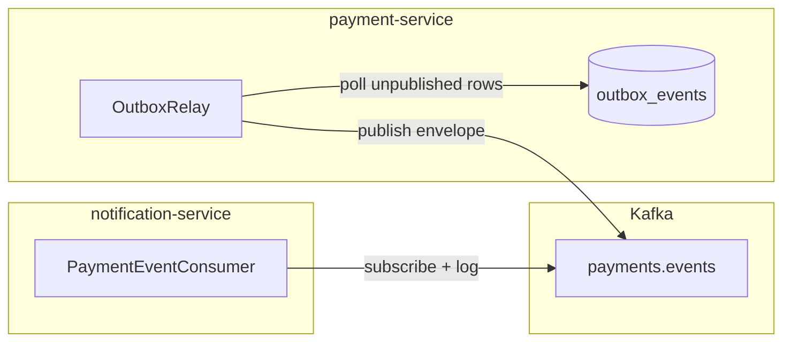

# Phase 3: Kafka integration

## What exists today

The outbox write-side is complete from Phase 2:
- [`TransactionalOutboxAppender`](backend/payment-service/src/main/java/com/payflow/payment/infrastructure/outbox/TransactionalOutboxAppender.java) writes domain events to the `outbox_events` table inside the same DB transaction as the payment mutation.
- [`OutboxEventJpaEntity`](backend/payment-service/src/main/java/com/payflow/payment/infrastructure/persistence/jpa/OutboxEventJpaEntity.java) maps the row (id, aggregate_id, event_type, payload JSONB, published flag).
- [`OutboxEventSpringDataRepository`](backend/payment-service/src/main/java/com/payflow/payment/infrastructure/persistence/jpa/OutboxEventSpringDataRepository.java) is a bare Spring Data interface with no custom queries yet.
- The Flyway migration already created an `idx_outbox_unpublished` index on `(published, created_at)`.

Nothing reads from the outbox or touches Kafka. The `notification-service` module is an empty placeholder.

## What Phase 3 delivers

Two components:



**1. Outbox relay** (payment-service) -- scheduled poller that reads unpublished rows, wraps each in the spec envelope, publishes to `payments.events`, then marks the row published.

**2. Notification service consumer** -- Spring Boot app subscribed to `payments.events` that logs every event. No webhook delivery yet (Phase 4).

---

## Part A: Outbox relay in payment-service

### A1. Dependencies

Add to [`payment-service/pom.xml`](backend/payment-service/pom.xml):
- `spring-kafka` (managed by Spring Boot BOM, no version needed)
- `org.testcontainers:kafka` test scope

### A2. Outbox repository query

Add a finder to [`OutboxEventSpringDataRepository`](backend/payment-service/src/main/java/com/payflow/payment/infrastructure/persistence/jpa/OutboxEventSpringDataRepository.java):

```java
List<OutboxEventJpaEntity> findByPublishedFalseOrderByCreatedAtAsc(Pageable pageable);
```

This hits the existing `idx_outbox_unpublished` index.

### A3. Kafka event envelope

Create `com.payflow.payment.infrastructure.kafka.PaymentEventEnvelope` -- a record matching the spec shape:

```java
public record PaymentEventEnvelope(
    String eventId,
    String eventType,
    String aggregateId,
    String merchantId,
    Instant occurredAt,
    Map<String, Object> payload
) {}
```

The relay builds this from the outbox row. `merchantId` is extracted from `payload.get("merchantId")` (every event payload already contains it).

### A4. OutboxRelay component

Create `com.payflow.payment.infrastructure.kafka.OutboxRelay`:
- `@Scheduled(fixedDelayString = "${payflow.outbox.poll-interval-ms:500}")` -- polls every 500ms by default.
- Reads a batch of up to 100 unpublished rows.
- For each row: builds `PaymentEventEnvelope`, serializes to JSON, sends to `payments.events` topic with `merchantId` as the Kafka key (for partition affinity per spec).
- On successful send callback: marks `published = true`, sets `published_at`.
- Uses `KafkaTemplate<String, String>` with a JSON string value (no schema registry in this phase).
- Handles send failures by logging and leaving the row unpublished for the next poll cycle.

### A5. Kafka producer configuration

Add to [`application.yml`](backend/payment-service/src/main/resources/application.yml):

```yaml
spring:
  kafka:
    bootstrap-servers: localhost:9092
    producer:
      key-serializer: org.apache.kafka.common.serialization.StringSerializer
      value-serializer: org.apache.kafka.common.serialization.StringSerializer
      acks: all
      retries: 3

payflow:
  outbox:
    poll-interval-ms: 500
    batch-size: 100
    topic: payments.events
```

### A6. Enable scheduling

Add `@EnableScheduling` to [`PaymentServiceApplication`](backend/payment-service/src/main/java/com/payflow/payment/PaymentServiceApplication.java).

### A7. Tests (TDD)

- **Unit test** `OutboxRelayTest` -- mock the repository and KafkaTemplate. Verify:
  - Unpublished rows are fetched.
  - Correct envelope shape is sent (eventId, eventType, aggregateId, merchantId, occurredAt, payload).
  - Partition key is the merchantId.
  - Rows are marked published after successful send.
  - Failed sends leave the row unpublished.
- **Integration test** `OutboxRelayIntegrationTest` -- Testcontainers (Postgres + Kafka). Create a payment via the API, verify the event lands on the `payments.events` topic with the correct envelope within a few seconds.

---

## Part B: Notification service (Kafka consumer)

### B1. Dependencies

Rewrite [`notification-service/pom.xml`](backend/notification-service/pom.xml) to add:
- `spring-boot-starter` (no web needed; pure consumer)
- `spring-kafka`
- `spring-boot-starter-test`, `testcontainers:junit-jupiter`, `testcontainers:kafka` (test scope)

### B2. Application bootstrap

Create `com.payflow.notification.NotificationServiceApplication` with `@SpringBootApplication`.

### B3. Event envelope record

Create `com.payflow.notification.event.PaymentEventEnvelope` -- mirrors the spec envelope. This is a separate class (the notification service has no dependency on payment-service).

### B4. PaymentEventConsumer

Create `com.payflow.notification.consumer.PaymentEventConsumer`:
- `@KafkaListener(topics = "payments.events", groupId = "notification-service")`
- Deserializes the envelope JSON.
- Logs at INFO level: event type, aggregate ID, merchant ID, occurred-at.
- This is intentionally minimal; webhook delivery gets added in Phase 4.

### B5. Configuration

Create `notification-service/src/main/resources/application.yml`:

```yaml
server:
  port: 8084

spring:
  application:
    name: notification-service
  kafka:
    bootstrap-servers: localhost:9092
    consumer:
      group-id: notification-service
      auto-offset-reset: earliest
      key-deserializer: org.apache.kafka.common.serialization.StringDeserializer
      value-deserializer: org.apache.kafka.common.serialization.StringDeserializer
```

### B6. Tests (TDD)

- **Unit test** `PaymentEventConsumerTest` -- verify the consumer deserializes and logs without error for each known event type, and handles malformed JSON gracefully.
- **Integration test** `NotificationConsumerIntegrationTest` -- Testcontainers Kafka. Publish a well-formed envelope to `payments.events`, assert the consumer processes it (verify via a spy/mock or log capture).

---

## Part C: Cross-service integration verification

Update the existing [`PaymentApiIntegrationTest`](backend/payment-service/src/test/java/com/payflow/payment/integration/PaymentApiIntegrationTest.java) with a Kafka container to verify end-to-end: create a payment via REST, confirm the outbox relay publishes the `payment.created` event to Kafka within the test timeout. This proves the full chain from HTTP request to Kafka topic inside a single integration test.

---

## TDD order

Following red-green-refactor, the build order is:

1. Write `OutboxRelayTest` (unit, red) -> build `OutboxRelay` (green) -> refactor
2. Write `OutboxRelayIntegrationTest` (red) -> add Kafka dependencies, config, wiring (green) -> refactor
3. Write `PaymentEventConsumerTest` (unit, red) -> build consumer (green) -> refactor
4. Write `NotificationConsumerIntegrationTest` (red) -> wire Spring Boot app + config (green) -> refactor
5. Update `PaymentApiIntegrationTest` with Kafka container for end-to-end verification

---

## Files created / modified

**payment-service (modified)**
- `pom.xml` -- add spring-kafka, testcontainers:kafka
- `application.yml` -- add Kafka producer + outbox config
- `PaymentServiceApplication.java` -- add `@EnableScheduling`
- `OutboxEventSpringDataRepository.java` -- add paginated finder

**payment-service (new)**
- `infrastructure/kafka/PaymentEventEnvelope.java`
- `infrastructure/kafka/OutboxRelay.java`
- `test/.../kafka/OutboxRelayTest.java`
- `test/.../integration/OutboxRelayIntegrationTest.java`

**notification-service (new / rewritten)**
- `pom.xml` -- full Spring Boot + Kafka dependencies
- `application.yml`
- `NotificationServiceApplication.java`
- `event/PaymentEventEnvelope.java`
- `consumer/PaymentEventConsumer.java`
- `test/.../consumer/PaymentEventConsumerTest.java`
- `test/.../integration/NotificationConsumerIntegrationTest.java`

**payment-service integration test (modified)**
- `PaymentApiIntegrationTest.java` -- add Kafka container for E2E check
