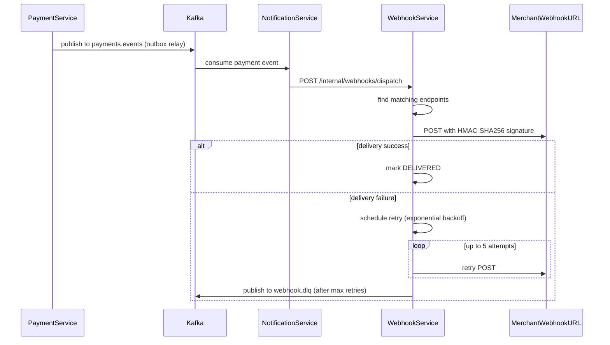

# Phase 4: Refunds and Webhooks

## Current state

- **Payment domain** already has `Payment.refund()`, `RefundId`, `PaymentRefundedEvent`, `InsufficientRefundableAmountException`, and statuses `REFUNDED`/`PARTIAL_REFUND`. The `totalRefunded` column exists in the DB. Tests cover refund domain logic.
- **Missing** in payment-service: application-layer `refund`/`listRefunds` use cases, REST endpoints, refunds table, `OutboxEventPayloadMapper` support for `PaymentRefundedEvent`, and refund DTOs.
- **Webhook-service** is a stub: empty module with only a `package-info.java` and JUnit dependency.
- **Notification-service** consumes `payments.events` and logs them. No webhook delivery logic.

---

## Stream 1: Refund use case (payment-service)

### 1A. Database: add `refunds` table

Add Flyway migration `V2__refunds_table.sql` to [backend/payment-service/src/main/resources/db/migration/](backend/payment-service/src/main/resources/db/migration/):

```sql
CREATE TABLE payments.refunds (
  id          VARCHAR(64)    PRIMARY KEY,
  payment_id  VARCHAR(64)    NOT NULL REFERENCES payments.payments(id),
  amount      NUMERIC(19,2)  NOT NULL,
  reason      TEXT,
  created_at  TIMESTAMPTZ    NOT NULL DEFAULT NOW()
);
CREATE INDEX idx_refunds_payment ON payments.refunds (payment_id);
```

### 1B. Domain: `Refund` value object

Create `Refund` in the domain package (pure Java, no JPA). Fields: `RefundId id`, `PaymentId paymentId`, `Money amount`, `String reason`, `Instant createdAt`. Used to return individual refund records from the application layer.

### 1C. Infrastructure: `RefundJpaEntity` + `RefundSpringDataRepository`

Follow the existing JPA pattern in [backend/payment-service/src/main/java/com/payflow/payment/infrastructure/persistence/jpa/](backend/payment-service/src/main/java/com/payflow/payment/infrastructure/persistence/jpa/):
- `RefundJpaEntity` mapped to `payments.refunds`
- `RefundSpringDataRepository` extending `JpaRepository`
- `JpaRefundRepositoryAdapter` implementing a new `RefundRepository` port
- `RefundPersistenceMapper` for domain <-> JPA mapping

### 1D. Application: extend `PaymentApplicationService`

Add a `RefundRepository` port in [application/port/](backend/payment-service/src/main/java/com/payflow/payment/application/port/):

```java
public interface RefundRepository {
    void insert(Refund refund);
    List<Refund> findByPaymentId(PaymentId paymentId);
}
```

Add `refund()` and `listRefunds()` methods to [PaymentApplicationService](backend/payment-service/src/main/java/com/payflow/payment/application/PaymentApplicationService.java):
- `refund(MerchantId, PaymentId, long amountMinor, String currency, Optional<String> reason)` -- calls `Payment.refund()`, persists the refund record, appends to outbox, returns `Refund`
- `listRefunds(MerchantId, PaymentId)` -- returns `List<Refund>`

Also add `confirmRefund` to [AcquiringPort](backend/payment-service/src/main/java/com/payflow/payment/application/port/AcquiringPort.java) and a no-op in `NoOpAcquiringAdapter`.

### 1E. Outbox: add `PaymentRefundedEvent` mapping

Extend [OutboxEventPayloadMapper](backend/payment-service/src/main/java/com/payflow/payment/infrastructure/outbox/OutboxEventPayloadMapper.java) to handle `PaymentRefundedEvent`:
- `eventType` returns `"payment.refunded"`
- `payload` returns `{ paymentId, refundId, refundAmount, remainingAmount, isFullRefund }`

### 1F. API: refund endpoints

Add to [PaymentsController](backend/payment-service/src/main/java/com/payflow/payment/api/PaymentsController.java):
- `POST /v1/payments/{id}/refunds` -- accepts `CreateRefundRequest` (amount, currency, reason?), returns 201 with `RefundResponse`
- `GET /v1/payments/{id}/refunds` -- returns `RefundListResponse`

New DTOs:
- `CreateRefundRequest` (amount: long, currency: String, reason?: String)
- `RefundResponse` (id, paymentId, amount, currency, reason, createdAt)
- `RefundListResponse` (data: List, totalElements)

Add `PaymentResponse.totalRefunded` (long, minor units) and `PaymentResponse.amountRefunded` to expose refund totals.

Add `InsufficientRefundableAmountException` handler in [ApiExceptionHandler](backend/payment-service/src/main/java/com/payflow/payment/api/ApiExceptionHandler.java) returning 400 with code `insufficient_refundable_amount`.

### 1G. Tests (TDD)

- **Unit**: `PaymentApplicationServiceTest` -- refund happy path, refund exceeds balance, refund on non-captured payment, list refunds
- **API**: `PaymentsControllerWebMvcTest` -- POST refund returns 201, GET refunds returns list, error cases
- **Integration**: `PaymentApiIntegrationTest` -- full refund flow with DB, partial refund flow, outbox publishes `payment.refunded`

---

## Stream 2: Webhook Service (from stub to full service)

### 2A. Bootstrap

Update [webhook-service/pom.xml](backend/webhook-service/pom.xml) with dependencies:
- `spring-boot-starter-web`, `spring-boot-starter-data-jpa`, `spring-boot-starter-validation`, `spring-boot-starter-json`
- `postgresql` driver, `flyway-core`, `flyway-database-postgresql`
- Test: `spring-boot-starter-test`, `testcontainers:junit-jupiter`, `testcontainers:postgresql`, `assertj-core`

Create `WebhookServiceApplication.java`, `application.yml` (port 8083, datasource pointing to `webhooks` schema).

### 2B. Domain layer

All under `com.payflow.webhook.domain` (pure Java, no Spring/JPA):

- **`WebhookId`** -- UUID wrapper (`wh_` prefix), same pattern as `PaymentId`
- **`WebhookEndpoint`** aggregate -- fields: `WebhookId id`, `MerchantId merchantId`, `String url`, `String secret` (HMAC key), `Set<String> eventTypes`, `boolean active`, `Instant createdAt`
  - Factory: `WebhookEndpoint.register(merchantId, url, secret, eventTypes, now)`
  - Behavior: `deactivate()`, `matchesEvent(eventType)`
  - Invariant: URL must start with `https://`
- **`WebhookDeliveryId`** -- UUID wrapper (`whd_` prefix)
- **`WebhookDelivery`** entity -- fields: `WebhookDeliveryId id`, `WebhookId webhookId`, `String eventType`, `String eventPayload`, `DeliveryStatus status`, `int attempts`, `Instant lastAttemptAt`, `Instant nextRetryAt`, `String lastError`
  - `DeliveryStatus` enum: `PENDING`, `DELIVERED`, `FAILED`
  - Behavior: `recordSuccess(now)`, `recordFailure(error, now)` (increments attempts, computes next retry time)
  - Retry schedule: attempts 1-5 map to delays of 5s, 30s, 2m, 10m, 1h
  - After 5 attempts, status transitions to `FAILED`
- **Domain exceptions**: `InvalidWebhookUrlException`, `MaxWebhookEndpointsExceededException` (max 5 per merchant)

### 2C. Application layer

Under `com.payflow.webhook.application`:

- **Ports**:
  - `WebhookEndpointRepository` -- `save`, `findByMerchantId`, `findById`, `countByMerchantId`, `findActiveByMerchantIdAndEventType`
  - `WebhookDeliveryRepository` -- `save`, `findByWebhookId`, `findPendingDueForRetry(now)`, `update`
  - `WebhookSender` -- `send(url, payload, secret): WebhookSendResult` (HTTP POST with HMAC-SHA256 signing)

- **Use cases**:
  - `RegisterWebhookUseCase` -- validates max 5 per merchant, generates HMAC secret, persists
  - `ListWebhooksUseCase` -- list by merchant
  - `DeactivateWebhookUseCase` -- soft-delete (set active=false)
  - `ListDeliveriesUseCase` -- list by webhook endpoint
  - `DispatchWebhookUseCase` -- called by notification-service (or internal): find active endpoints for merchant+eventType, create `WebhookDelivery` records per endpoint, attempt first delivery
  - `RetryFailedDeliveriesUseCase` -- picks up `PENDING` deliveries where `nextRetryAt <= now`, retries, updates status

### 2D. Infrastructure

- **DB migration** (`V1__webhooks_schema.sql`):
  ```sql
  CREATE SCHEMA IF NOT EXISTS webhooks;

  CREATE TABLE webhooks.webhook_endpoints (
    id           VARCHAR(64) PRIMARY KEY,
    merchant_id  VARCHAR(64) NOT NULL,
    url          TEXT        NOT NULL,
    secret       VARCHAR(128) NOT NULL,
    event_types  JSONB       NOT NULL DEFAULT '[]',
    active       BOOLEAN     NOT NULL DEFAULT TRUE,
    created_at   TIMESTAMPTZ NOT NULL DEFAULT NOW()
  );
  CREATE INDEX idx_webhook_merchant ON webhooks.webhook_endpoints(merchant_id);

  CREATE TABLE webhooks.webhook_deliveries (
    id              VARCHAR(64) PRIMARY KEY,
    webhook_id      VARCHAR(64) NOT NULL REFERENCES webhooks.webhook_endpoints(id),
    event_type      VARCHAR(100) NOT NULL,
    event_payload   JSONB       NOT NULL,
    status          VARCHAR(20) NOT NULL DEFAULT 'PENDING',
    attempts        INT         NOT NULL DEFAULT 0,
    last_attempt_at TIMESTAMPTZ,
    next_retry_at   TIMESTAMPTZ,
    last_error      TEXT,
    created_at      TIMESTAMPTZ NOT NULL DEFAULT NOW()
  );
  CREATE INDEX idx_delivery_webhook ON webhooks.webhook_deliveries(webhook_id);
  CREATE INDEX idx_delivery_pending ON webhooks.webhook_deliveries(status, next_retry_at);
  ```

- **JPA entities/repos**: `WebhookEndpointJpaEntity`, `WebhookDeliveryJpaEntity`, Spring Data repos, adapter classes, persistence mappers
- **HMAC signer**: `HmacSha256WebhookSender` -- computes `HMAC-SHA256(secret, body)`, sets `Payflow-Signature` header, sends HTTP POST via `RestClient`
- **Retry scheduler**: `@Scheduled` task that calls `RetryFailedDeliveriesUseCase` every 5 seconds
- **Kafka DLQ producer**: After 5 failed attempts, publish the delivery to `webhook.dlq` topic

### 2E. API layer

Under `com.payflow.webhook.api`:

- **`WebhooksController`** (`/v1/webhooks`):
  - `POST /` -- register endpoint (body: url, events). Returns 201 with webhook + secret
  - `GET /` -- list endpoints for authenticated merchant
  - `DELETE /{id}` -- deactivate endpoint
  - `GET /{id}/deliveries` -- list delivery attempts

- **DTOs**: `RegisterWebhookRequest`, `WebhookResponse`, `WebhookListResponse`, `DeliveryResponse`, `DeliveryListResponse`
- **Security**: reuse the same API key auth filter pattern from payment-service (`ApiKeyAuthenticationFilter`, `MerchantContext`)
- **Exception handler**: same error response shape as payment-service

### 2F. Tests (TDD)

- **Domain unit tests**: `WebhookEndpointTest` (register, deactivate, HTTPS validation, event matching), `WebhookDeliveryTest` (success/failure recording, retry schedule, max attempts)
- **Application tests**: register with max-5 limit, dispatch creates deliveries, retry picks up due deliveries
- **Integration tests**: full CRUD via API with Testcontainers (PostgreSQL), delivery tracking

---

## Stream 3: Notification Service enhancement

### 3A. Webhook dispatch integration

Enhance [PaymentEventConsumer](backend/notification-service/src/main/java/com/payflow/notification/consumer/PaymentEventConsumer.java):
- On receiving a payment event, call webhook-service REST endpoint to dispatch delivery
- Example: `POST http://webhook-service:8083/internal/webhooks/dispatch` with `{ merchantId, eventType, payload }`
- Use `RestClient` (Spring 6.1) or `WebClient` for HTTP calls

### 3B. Webhook service internal API

Add an internal controller in webhook-service (no auth, cluster-only):
- `POST /internal/webhooks/dispatch` -- accepts `{ merchantId, eventType, eventPayload }`
- Calls `DispatchWebhookUseCase` which finds matching endpoints and triggers delivery

### 3C. DLQ handling

When `WebhookDelivery` reaches max attempts (5), the retry scheduler publishes to `webhook.dlq` Kafka topic with the full delivery context. Add Kafka dependencies to webhook-service for this purpose.

### 3D. Tests

- **Notification service**: integration test verifying event consumption triggers webhook dispatch call (WireMock for webhook-service)
- **Webhook service**: integration test for dispatch + delivery with WireMock for merchant webhook URLs

---

## Architecture flow



## File creation/modification summary

**payment-service** (modify existing):
- New migration: `V2__refunds_table.sql`
- New domain: `Refund.java`
- New infra: `RefundJpaEntity`, `RefundSpringDataRepository`, `JpaRefundRepositoryAdapter`, `RefundPersistenceMapper`
- New app port: `RefundRepository`
- Modify: `PaymentApplicationService`, `AcquiringPort`, `NoOpAcquiringAdapter`, `OutboxEventPayloadMapper`
- New API DTOs: `CreateRefundRequest`, `RefundResponse`, `RefundListResponse`
- Modify: `PaymentsController`, `PaymentApiMapper`, `PaymentResponse`, `ApiExceptionHandler`
- New/modify tests: unit + integration + API

**webhook-service** (build from stub):
- ~25-30 new Java files across domain, application, infrastructure, and api packages
- 1 Flyway migration
- `application.yml`
- Tests across all layers

**notification-service** (enhance):
- Add REST client for webhook-service dispatch
- Modify `PaymentEventConsumer` to trigger dispatch
- Add `application.yml` config for webhook-service URL
- Tests with WireMock
