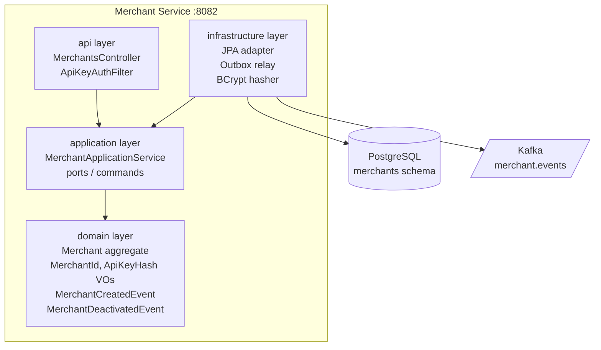

# Phase 5: Merchant service

## Current state

The `merchant-service` module exists as a placeholder: a `pom.xml` with only JUnit, a `package-info.java`, and documentation stubs. No domain, application, infrastructure, or API code exists yet.

Auth across all services currently relies on static `payflow.security.api-keys` entries in `application.yml`. In this phase, the merchant-service will introduce DB-backed API key validation using BCrypt. Payment-service and webhook-service keep their static config for now.

## Architecture



## Decisions

- **Auth in merchant-service only**: DB-backed BCrypt key validation. Other services keep static config.
- **Outbox pattern**: Publish `MerchantCreatedEvent` and `MerchantDeactivatedEvent` to `merchant.events` Kafka topic via the same transactional outbox pattern used in payment-service. No notification-service consumer for these events yet.
- **API key lookup strategy**: Store a `key_prefix` (first 8 characters of the raw key) in plaintext for fast DB lookup, plus the BCrypt hash for verification. This avoids iterating all merchants on every request while keeping the full key hashed.
- **Registration is unauthenticated**: `POST /v1/merchants` does not require a Bearer token (creating the initial merchant). All other `/v1/` endpoints require the merchant's own API key.

## Domain layer (pure Java, no Spring)

Under `com.payflow.merchant.domain`:

- **`MerchantId`** value object: `mer_` + UUID (same pattern as [payment-service MerchantId](backend/payment-service/src/main/java/com/payflow/payment/domain/MerchantId.java))
- **`Merchant`** aggregate root:
  - Fields: `merchantId`, `name`, `email`, `keyPrefix`, `keyHash`, `isActive`, `createdAt`, `deactivatedAt`
  - `Merchant.register(name, email, rawApiKey, hashedKey, now)` -- factory method, emits `MerchantCreatedEvent`
  - `deactivate(now)` -- sets `isActive = false`, emits `MerchantDeactivatedEvent`
  - `rotateApiKey(rawApiKey, hashedKey)` -- updates key prefix + hash
  - Domain events stored in internal list, pulled via `pullDomainEvents()` (same pattern as `Payment`)
- **`ApiKeyHash`** value object: wraps BCrypt hash string
- **Domain events**: `MerchantCreatedEvent(occurredAt, merchantId, name, email)`, `MerchantDeactivatedEvent(occurredAt, merchantId, deactivatedAt)`
- **Domain exceptions**: `DomainException`, `DuplicateEmailException`, `MerchantAlreadyDeactivatedException`
- **`DomainEvent`** marker interface

## Application layer

Under `com.payflow.merchant.application`:

- **`MerchantApplicationService`**: orchestrates use cases (register, findById, deactivate, rotateApiKey)
- **Ports (interfaces)**:
  - `MerchantRepository` -- `insert`, `findById`, `findByKeyPrefix`, `existsByEmail`
  - `DomainEventOutbox` -- `append(aggregateId, events)`
  - `ApiKeyHasher` -- `hash(rawKey): String`, `matches(rawKey, hash): boolean`
- **Commands**: `RegisterMerchantCommand(name, email)`, `RotateApiKeyCommand`
- **Results**: `RegisteredMerchantResult(merchant, rawApiKey)` -- raw key returned once at registration
- **Exceptions**: `MerchantNotFoundException`
- **`ApiKeyGenerator`**: generates `sk_test_` + 32 random hex chars

## Infrastructure layer

Under `com.payflow.merchant.infrastructure`:

- **JPA**: `MerchantJpaEntity`, `OutboxEventJpaEntity`, Spring Data repositories, `JpaMerchantRepositoryAdapter` implementing the port
- **Outbox**: `TransactionalOutboxAppender` (same pattern as payment-service), `MerchantEventPayloadMapper`
- **Kafka**: `OutboxRelay` (scheduled poll, publish to `merchant.events`), `MerchantEventEnvelope` record
- **Security**: `BCryptApiKeyHasher` implementing `ApiKeyHasher` port

## API layer

Under `com.payflow.merchant.api`:

### REST endpoints

| Method | Path | Auth | Description |
|--------|------|------|-------------|
| `POST` | `/v1/merchants` | None | Register a new merchant. Returns merchant profile + raw API key (shown once). |
| `GET` | `/v1/merchants/me` | Bearer | Get the authenticated merchant's profile. |
| `DELETE` | `/v1/merchants/me` | Bearer | Deactivate the authenticated merchant. |
| `POST` | `/v1/merchants/me/api-keys` | Bearer | Rotate API key. Returns new raw key (shown once). |

### Security

- **`ApiKeyAuthenticationFilter`**: same `OncePerRequestFilter` pattern, but instead of a static map, looks up `key_prefix` in the DB, then `BCrypt.matches()` the full key. Skips `/v1/merchants` POST (registration). All other `/v1/` paths require auth.
- **`MerchantContext`**: thread-local holder (same pattern as existing services)
- **`RequestIdFilter`**: same pattern for `X-Request-Id`
- **`ApiExceptionHandler`**: standard `{ "error": { "code", "message", "param?", "requestId" } }` shape

### DTOs

- `RegisterMerchantRequest` (name, email) with Jakarta Validation
- `RegisterMerchantResponse` (id, name, email, apiKey, createdAt)
- `MerchantResponse` (id, name, email, isActive, createdAt)
- `RotateApiKeyResponse` (apiKey)

## Database schema

Flyway migration `V1__merchants_schema.sql` in the `merchants` schema:

```sql
CREATE SCHEMA IF NOT EXISTS merchants;

CREATE TABLE merchants.merchants (
    id              VARCHAR(64)  PRIMARY KEY,
    name            VARCHAR(255) NOT NULL,
    email           VARCHAR(320) NOT NULL,
    key_prefix      VARCHAR(16)  NOT NULL,
    key_hash        VARCHAR(128) NOT NULL,
    is_active       BOOLEAN      NOT NULL DEFAULT TRUE,
    created_at      TIMESTAMPTZ  NOT NULL DEFAULT NOW(),
    deactivated_at  TIMESTAMPTZ
);

CREATE UNIQUE INDEX idx_merchant_email ON merchants.merchants (email);
CREATE INDEX idx_merchant_key_prefix ON merchants.merchants (key_prefix);

CREATE TABLE merchants.outbox_events (
    id            UUID           PRIMARY KEY,
    aggregate_id  VARCHAR(64)    NOT NULL,
    event_type    VARCHAR(100)   NOT NULL,
    payload       JSONB          NOT NULL,
    created_at    TIMESTAMPTZ    NOT NULL DEFAULT NOW(),
    published_at  TIMESTAMPTZ,
    published     BOOLEAN        NOT NULL DEFAULT FALSE
);

CREATE INDEX idx_outbox_unpublished ON merchants.outbox_events (published, created_at);
```

## Configuration

`application.yml` on port **8082**, PostgreSQL `merchants` schema, Kafka producer config, outbox settings for `merchant.events` topic. Same structure as [payment-service application.yml](backend/payment-service/src/main/resources/application.yml).

## Kafka events

Published to `merchant.events` topic, keyed by `merchantId`, using the standard envelope:

```json
{
  "eventId": "evt_01HX...",
  "eventType": "merchant.created",
  "aggregateId": "mer_abc",
  "merchantId": "mer_abc",
  "occurredAt": "2024-09-01T12:00:00Z",
  "payload": { "merchantId": "mer_abc", "name": "Acme Corp", "email": "admin@acme.com", "createdAt": "..." }
}
```

## TDD test plan

### Domain unit tests (pure Java, no Spring)

- `MerchantTest`: register creates ACTIVE merchant with events; deactivate from active emits event; deactivate already-inactive throws; rotateApiKey updates prefix+hash
- `MerchantIdTest`: generate produces `mer_` prefix; of(blank) throws; equals/hashCode contract
- `ApiKeyHashTest`: construction rejects blank; equals/hashCode

### Application unit tests (Mockito, no Spring context)

- `MerchantApplicationServiceTest`: register persists + appends outbox events; duplicate email throws; deactivate calls deactivate on aggregate; merchant not found throws; rotate key returns new raw key

### Integration tests (Testcontainers PostgreSQL + Kafka)

- `MerchantApiIntegrationTest`: full Spring Boot context with Testcontainers
  - POST /v1/merchants returns 201 with raw API key
  - GET /v1/merchants/me with valid key returns merchant
  - GET /v1/merchants/me without key returns 401
  - DELETE /v1/merchants/me deactivates merchant
  - POST /v1/merchants/me/api-keys rotates key; old key stops working
  - Duplicate email returns 409
- `OutboxRelayIntegrationTest`: verify events land on `merchant.events` topic

## Build changes

- Update [merchant-service pom.xml](backend/merchant-service/pom.xml) to match payment-service deps (Spring Web, JPA, Validation, Flyway, PostgreSQL, Kafka, Testcontainers, JaCoCo)
- Add `spring-boot-maven-plugin` with `mainClass` config
- Add JaCoCo coverage rules for domain (100% line/branch) and application/api layers

## Implementation order (TDD flow)

Work proceeds red-green-refactor. Each step starts with a failing test.

1. **Domain layer**: `MerchantId` + tests, `Merchant` aggregate + tests, domain events, domain exceptions
2. **Application layer**: ports, commands, `MerchantApplicationService` + tests (mocked ports)
3. **Infrastructure layer**: pom.xml deps, Flyway migration, JPA entities/repos, BCrypt hasher, outbox appender, outbox relay
4. **API layer**: DTOs, controller, auth filter, exception handler, `application.yml`
5. **Integration tests**: full Spring Boot + Testcontainers for REST + Kafka outbox
6. **Docs update**: refresh `domain-model.md` and `class-diagram.md`
