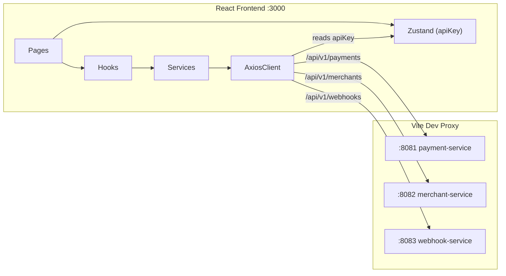

# Phase 6: React frontend dashboard

## Context

The frontend at [`frontend/`](frontend/) is a bare Vite + React 19 + TypeScript scaffold with no routing, no styling framework, and no application code beyond the Vite starter. The backend exposes three REST services:

- **payment-service** `:8081` -- `POST/GET /v1/payments`, capture, cancel, refunds
- **merchant-service** `:8082` -- `POST /v1/merchants`, `GET/DELETE /v1/merchants/me`, key rotation
- **webhook-service** `:8083` -- `POST/GET/DELETE /v1/webhooks`, `GET /v1/webhooks/:id/deliveries`

All protected endpoints authenticate via `Authorization: Bearer sk_test_...`.

---

## 1. Foundation: dependencies and tooling

Install production dependencies:

```bash
npm install react-router-dom @tanstack/react-query zustand zod recharts axios
```

Install and configure Tailwind CSS v4 + shadcn/ui (uses `npx shadcn@latest init`). This generates `components.json`, `src/lib/utils.ts`, and wires PostCSS/Tailwind.

Install required shadcn/ui components incrementally as pages are built:

- `button`, `input`, `label`, `card`, `table`, `badge`, `dialog`, `select`, `tabs`, `toast`, `dropdown-menu`, `separator`, `skeleton`, `tooltip`, `sidebar`, `sheet`, `form`

Update [`vite.config.ts`](frontend/vite.config.ts) with the `/api` proxy:

```typescript
server: {
  proxy: {
    '/api/v1/payments': {
      target: 'http://localhost:8081',
      rewrite: (path) => path.replace(/^\/api/, ''),
      changeOrigin: true,
    },
    '/api/v1/merchants': {
      target: 'http://localhost:8082',
      rewrite: (path) => path.replace(/^\/api/, ''),
      changeOrigin: true,
    },
    '/api/v1/webhooks': {
      target: 'http://localhost:8083',
      rewrite: (path) => path.replace(/^\/api/, ''),
      changeOrigin: true,
    },
  },
}
```

Update [`vitest.config.ts`](frontend/vitest.config.ts) to use `jsdom` environment (currently `node`) so component tests can render DOM.

---

## 2. Project structure

```
src/
  components/
    ui/               # shadcn/ui generated components
    layout/
      AppLayout.tsx    # sidebar + header shell wrapping <Outlet />
      Sidebar.tsx      # navigation links
    PaymentStatusBadge.tsx
    VolumeChart.tsx
    PaymentTable.tsx
    WebhookDeliveryLog.tsx
  pages/
    OverviewPage.tsx
    PaymentsPage.tsx
    PaymentDetailPage.tsx
    RefundPage.tsx
    WebhooksPage.tsx
    SettingsPage.tsx
    NotFoundPage.tsx
  hooks/
    usePayments.ts     # TanStack Query hooks for payment endpoints
    useWebhooks.ts     # TanStack Query hooks for webhook endpoints
    useMerchant.ts     # TanStack Query hooks for merchant endpoints
  services/
    api-client.ts      # axios instance with /api base + auth interceptor
    payments.ts        # payment API functions
    webhooks.ts        # webhook API functions
    merchants.ts       # merchant API functions
  stores/
    auth-store.ts      # Zustand: apiKey, merchantId, setApiKey, clearApiKey
  types/
    payment.ts         # PaymentResponse, PaymentListResponse, RefundResponse, etc.
    webhook.ts         # WebhookSummaryResponse, DeliveryResponse, etc.
    merchant.ts        # MerchantResponse, RegisterMerchantResponse, etc.
    error.ts           # ApiError shape: { error: { code, message, param?, requestId } }
  lib/
    utils.ts           # shadcn cn() utility
    format.ts          # formatCurrency(), formatDate(), etc.
  App.tsx              # React Router + QueryClientProvider + layout
  main.tsx             # entry point
  index.css            # Tailwind directives
```

---

## 3. API client layer

[`src/services/api-client.ts`](frontend/src/services/api-client.ts): create an axios instance with `baseURL: '/api'`. An interceptor reads the API key from the Zustand auth store and sets the `Authorization: Bearer ...` header on every request.

Type files in `src/types/` mirror the backend DTOs exactly (records from the backend become TypeScript interfaces). Zod schemas validate server responses where needed; at minimum, the payment list response and error responses should be validated.

Service files (`payments.ts`, `webhooks.ts`, `merchants.ts`) are thin wrappers returning typed promises:

```typescript
// src/services/payments.ts
export const listPayments = (params: { page?: number; size?: number; status?: string }) =>
  apiClient.get<PaymentListResponse>('/v1/payments', { params });
```

---

## 4. Auth store (Zustand)

[`src/stores/auth-store.ts`](frontend/src/stores/auth-store.ts): persists `apiKey` to `localStorage`. When the key is absent, the app shows the Settings page with a prompt to enter or register a key. The store also derives a `isAuthenticated` boolean.

---

## 5. Routing and layout

[`src/App.tsx`](frontend/src/App.tsx): `BrowserRouter` > `QueryClientProvider` > `Routes`:

| Route | Page |
|-------|------|
| `/` | OverviewPage |
| `/payments` | PaymentsPage |
| `/payments/:id` | PaymentDetailPage |
| `/refunds` | RefundPage |
| `/webhooks` | WebhooksPage |
| `/settings` | SettingsPage |
| `*` | NotFoundPage |

All routes inside `<AppLayout>` (sidebar + header). The sidebar highlights the active route.

---

## 6. Pages (implementation details)

### 6a. Overview (`/`)

- KPI cards: total volume, transaction count, success rate (captured / total), refund rate (refunded / total). Computed from `GET /v1/payments?size=1000` (or paginate through; for a portfolio demo a single large fetch is acceptable).
- **VolumeChart**: Recharts `AreaChart` grouping payments by day for the last 30 days.
- Uses `useQuery` with a suitable stale time.

### 6b. Payments (`/payments`)

- **PaymentTable**: paginated table (`GET /v1/payments?page=N&size=20`).
- Status filter dropdown (PENDING, CAPTURED, CANCELLED, REFUNDED, PARTIAL_REFUND, EXPIRED).
- Each row links to `/payments/:id`.
- **PaymentStatusBadge**: colour-coded badge per status.

### 6c. Payment detail (`/payments/:id`)

- Fetches single payment (`GET /v1/payments/:id`) + refund list (`GET /v1/payments/:id/refunds`).
- Status timeline (visual steps: created -> captured/cancelled -> refunded/expired).
- Card info display (last4, brand, expiry).
- Action buttons: Capture (if PENDING), Cancel (if PENDING), Refund (if CAPTURED; opens dialog/navigates to refund form).
- Refund history table.

### 6d. Refund (`/refunds`)

- **RefundForm**: controlled form validated by Zod.
- Fields: payment ID (text input or pre-filled from URL query param `?paymentId=`), amount (with currency display), reason (optional).
- Confirmation dialog before submission.
- Calls `POST /v1/payments/:id/refunds`.

### 6e. Webhooks (`/webhooks`)

- List of registered endpoints (`GET /v1/webhooks`).
- "Add endpoint" form: URL (must be HTTPS), event types (multi-select checkboxes).
- Delete button per endpoint (`DELETE /v1/webhooks/:id`).
- Expandable/click-through delivery history per endpoint (`GET /v1/webhooks/:id/deliveries`).
- **WebhookDeliveryLog**: auto-refreshes every 5 seconds using `refetchInterval`.

### 6f. Settings (`/settings`)

- Display current API key (masked, e.g., `sk_test_••••••ab`).
- "Enter API key" input for connecting to an existing merchant.
- "Register new merchant" form (name + email) calling `POST /v1/merchants`.
- "Rotate key" button calling `POST /v1/merchants/me/api-keys`.
- Merchant profile card (`GET /v1/merchants/me`).

---

## 7. Reusable components

- **PaymentStatusBadge**: maps status string to shadcn `Badge` variant + color (green for CAPTURED, yellow for PENDING, red for CANCELLED, etc.).
- **VolumeChart**: Recharts `AreaChart` with date X-axis, amount Y-axis, gradient fill.
- **PaymentTable**: shadcn `Table` with sortable headers, status badges, formatted amounts.
- **WebhookDeliveryLog**: table of delivery attempts with status icons, polling via `refetchInterval: 5000`.

---

## 8. Testing strategy

- **Vitest + Testing Library**: unit tests for components and hooks.
- Mock API responses with `vi.mock` or MSW (Mock Service Worker) for integration-style tests.
- Key test scenarios:
  - PaymentStatusBadge renders correct variant for each status
  - PaymentTable renders rows from mock data
  - RefundForm validates amount > 0 and required fields via Zod
  - Auth store persists/clears API key in localStorage
  - API client attaches Bearer header when key is present
  - Unauthenticated state redirects to settings

---

## 9. Data flow diagram



---

## 10. TDD approach for the frontend

Each page and component follows the same rhythm:

1. Write a failing test (render component, assert expected content or behavior)
2. Build the minimal component to pass the test
3. Refactor styling and extract shared pieces

Start with foundational layers (types, API client, stores, hooks) before page components, since pages depend on all of them.
