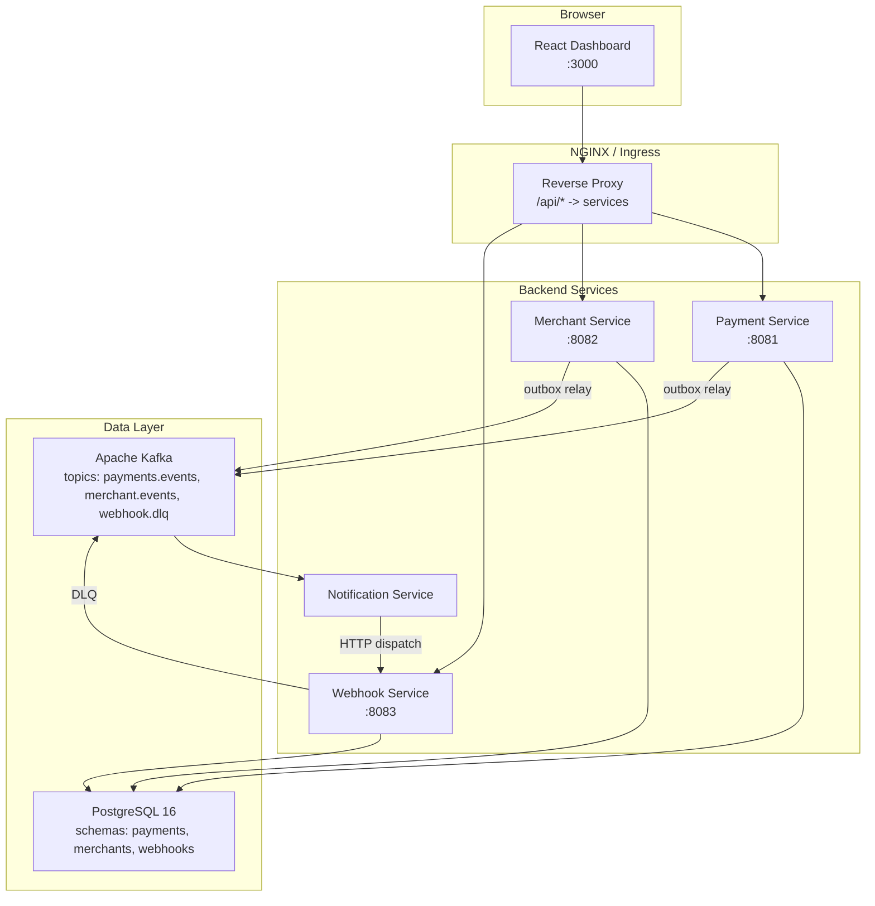

# Phase 7: Infrastructure and polish

## Scope (from spec section 11)

> Docker Compose, Kubernetes manifests, GitHub Actions CI, README with architecture diagram.

Cross-referenced with spec sections 10.1, 10.2, 10.3, and section 8 (project structure).

---

## Current state

- **`infra/docker-compose.yml`** -- placeholder (`alpine` under `future` profile); no real services.
- **Dockerfiles** -- none in the repo.
- **Kubernetes** -- no `infra/k8s/` directory.
- **CI** -- two workflows exist ([`.github/workflows/backend-ci.yml`](.github/workflows/backend-ci.yml) and [`frontend-ci.yml`](.github/workflows/frontend-ci.yml)) that run tests but do not build or push Docker images.
- **README** -- functional but has no architecture diagram.

---

## 1. Dockerfiles

Create a multi-stage `Dockerfile` for each deployable unit.

### Backend services (4 files, identical pattern)

Each backend module produces a Spring Boot fat JAR via `spring-boot-maven-plugin`. The Dockerfile:

- **Stage 1 (build):** `eclipse-temurin:21-jdk` + Maven wrapper; copy the full `backend/` tree (parent POM + modules); `./mvnw -pl <module> -am -DskipTests package`
- **Stage 2 (run):** `eclipse-temurin:21-jre`; copy the JAR; expose the service port; `ENTRYPOINT ["java", "-jar", "app.jar"]`

Files to create:

- [`backend/payment-service/Dockerfile`](backend/payment-service/Dockerfile)
- [`backend/merchant-service/Dockerfile`](backend/merchant-service/Dockerfile)
- [`backend/webhook-service/Dockerfile`](backend/webhook-service/Dockerfile)
- [`backend/notification-service/Dockerfile`](backend/notification-service/Dockerfile)

Build context for all four is `backend/` (so the parent POM is available). Each Dockerfile is placed inside its module for clarity but docker-compose `build.context` points to `../backend`.

### Frontend

- **Stage 1 (build):** `node:20-alpine`; `npm ci && npm run build` producing `dist/`.
- **Stage 2 (serve):** `nginx:alpine`; copy `dist/` to `/usr/share/nginx/html`; copy a custom `nginx.conf` that serves the SPA and reverse-proxies `/api/*` to backend services (mirroring the Vite proxy table).

Files:

- [`frontend/Dockerfile`](frontend/Dockerfile)
- [`frontend/nginx.conf`](frontend/nginx.conf) -- upstream blocks for `payment-service:8081`, `merchant-service:8082`, `webhook-service:8083`; `try_files $uri /index.html` for SPA routing.

---

## 2. Docker Compose (local dev stack)

Replace the placeholder in [`infra/docker-compose.yml`](infra/docker-compose.yml).

Services (matching spec section 10.1):

| Service | Image / build | Exposed port | Notes |
|---------|---------------|-------------|-------|
| **postgres** | `postgres:16-alpine` | 5432 | Single container; Flyway creates per-service schemas. Init script creates the `payflow` DB and user. |
| **kafka** | `bitnami/kafka:3.7` (KRaft, no Zookeeper) | 9092 | Single broker; KRaft mode simplifies the stack. |
| **kafka-ui** | `provectuslabs/kafka-ui` | 8080 | Browse topics and messages. |
| **payment-service** | build from `backend/payment-service/Dockerfile` | 8081 | Env overrides: `SPRING_DATASOURCE_URL`, `SPRING_KAFKA_BOOTSTRAP_SERVERS`. Depends on postgres, kafka. |
| **merchant-service** | build | 8082 | Same pattern. |
| **webhook-service** | build | 8083 | Same pattern. |
| **notification-service** | build | (none) | Env: Kafka bootstrap + `payflow.webhook-dispatch.base-url=http://webhook-service:8083`. |
| **frontend** | build from `frontend/Dockerfile` | 3000 | nginx proxies `/api/v1/payments` to `payment-service:8081`, etc. |

Environment variables will override `localhost` references from `application.yml` with Docker-network hostnames (e.g. `jdbc:postgresql://postgres:5432/payflow`).

A `.env.example` at the repo root will document overridable variables (`POSTGRES_PASSWORD`, etc.).

Health checks: `pg_isready` for Postgres; Spring Boot actuator or TCP for Java services; `curl` for nginx.

---

## 3. Kubernetes manifests

Create `infra/k8s/` with subdirectories per spec section 10.2 and project structure section 8.

```
infra/k8s/
  namespace.yml
  postgres/
    pvc.yml
    deployment.yml
    service.yml
    configmap.yml        # init SQL
    secret.yml           # DB password (base64 placeholder)
  kafka/
    deployment.yml
    service.yml
  payment-service/
    deployment.yml       # 2 replicas, resource limits
    service.yml          # ClusterIP
    configmap.yml        # DB host, Kafka brokers, topic
    hpa.yml              # scale 2-10 on CPU > 60%
  merchant-service/
    deployment.yml
    service.yml
    configmap.yml
  webhook-service/
    deployment.yml
    service.yml
    configmap.yml
  notification-service/
    deployment.yml
    configmap.yml        # Kafka + webhook-dispatch base URL
  frontend/
    deployment.yml
    service.yml
  ingress.yml            # NGINX ingress: /api/* -> backend, /* -> frontend
  secrets.yml            # API keys, DB password (placeholder values)
```

All manifests use a `payflow` namespace. Image tags reference `ghcr.io/oscarlima/payflow/<service>:latest` (matching the CI push target). ConfigMaps carry non-sensitive config; Secrets carry DB passwords and API keys with base64 placeholder values and a comment to replace them.

---

## 4. GitHub Actions CI/CD enhancement

Extend the two existing workflows per spec section 10.3.

### [`backend-ci.yml`](.github/workflows/backend-ci.yml)

Add a **`docker`** job that runs **only on push to `main`** (not PRs), after the `verify` job passes:

- Log in to GHCR (`docker/login-action`)
- Build and push each service image using `docker/build-push-action` with a matrix (`payment-service`, `merchant-service`, `webhook-service`, `notification-service`)
- Tag: `ghcr.io/${{ github.repository }}/<service>:latest` and `:sha-<short>`

### [`frontend-ci.yml`](.github/workflows/frontend-ci.yml)

Same pattern: add a `docker` job on merge to main that builds `frontend/Dockerfile` and pushes `ghcr.io/${{ github.repository }}/frontend:latest`.

---

## 5. README with architecture diagram

Update the root [`README.md`](README.md) with:

- A **Mermaid architecture diagram** showing the high-level component view (React dashboard, API gateway/ingress, four backend services, Kafka, PostgreSQL, and the event flow)
- A **quick start** section for `docker compose up` (one-command local dev)
- Updated **project structure** tree reflecting the new `infra/` contents
- Links to each `PHASE*.md` for detailed context on each build phase
- Brief table of services with ports

The diagram will look something like:



---

## 6. Phase doc and .dockerignore

- Create **`PHASE7_INFRA_POLISH.md`** at the repo root documenting what this phase added, how to use Compose, how to deploy to K8s, and CI/CD flow.
- Add **`.dockerignore`** files to `backend/` and `frontend/` to keep images lean (exclude `node_modules`, `.git`, `target/`, test files, etc.).

---

## File change summary

| Action | Files |
|--------|-------|
| **Create** | 4 backend Dockerfiles, 1 frontend Dockerfile, `frontend/nginx.conf`, ~20 K8s manifests under `infra/k8s/`, `.env.example`, `.dockerignore` files, `PHASE7_INFRA_POLISH.md` |
| **Replace** | `infra/docker-compose.yml` (placeholder -> full stack) |
| **Edit** | `.github/workflows/backend-ci.yml`, `.github/workflows/frontend-ci.yml`, `README.md` |
