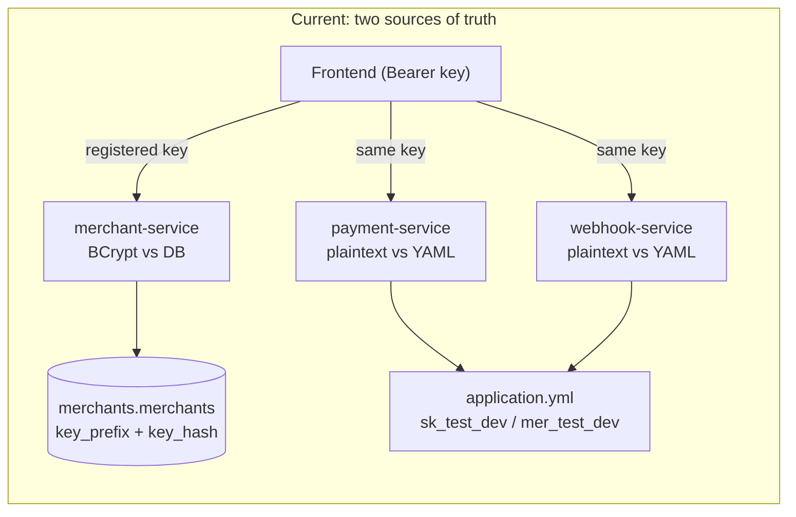
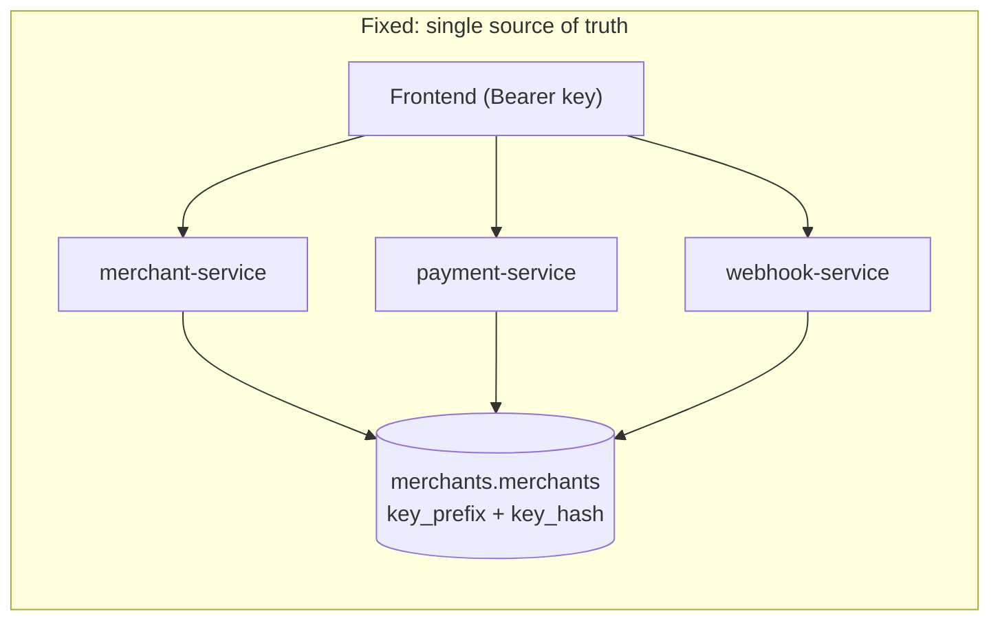

# Unify API key validation across all services

## The problem

Three services validate API keys using **two different mechanisms**:

- **merchant-service**: Looks up by 8-char `key_prefix`, then BCrypt-matches the raw key against `merchants.merchants.key_hash`. Works correctly with dynamically registered merchants.
- **payment-service** and **webhook-service**: Compare the raw Bearer token against a **static YAML allowlist** (`payflow.security.api-keys`) using plain string equality. Only the hardcoded `sk_test_dev` / `mer_test_dev` pair works.

When a merchant registers through the dashboard, merchant-service generates a random key (e.g. `sk_test_8a3f...`) and stores its BCrypt hash. The frontend saves that key. But payment-service and webhook-service only accept `sk_test_dev`, so every call to `/v1/payments` or `/v1/webhooks` returns **401 Unauthorized**.

The secondary **400 Bad Request** after manually saving `sk_test_dev` happens because the resolved `mer_test_dev` merchant ID doesn't correspond to any real merchant row, causing downstream validation failures.



## The fix: JDBC-based auth in payment-service and webhook-service

Both services already connect to the same PostgreSQL instance. They only need **read access** to the `merchants` schema to do the same prefix + BCrypt lookup that merchant-service does. No shared Maven module needed; the auth code is ~30 lines per service.



## Changes per service

### payment-service

- **Add `spring-security-crypto` dependency** to [`backend/payment-service/pom.xml`](backend/payment-service/pom.xml) (for `BCryptPasswordEncoder`; managed version from Spring Boot BOM).
- **Create `JdbcApiKeyAuthenticator`** in `com.payflow.payment.api.security` that:
  - Injects `JdbcTemplate` (already available via `spring-boot-starter-data-jpa`).
  - Queries `SELECT id, key_prefix, key_hash, is_active FROM merchants.merchants WHERE key_prefix = ?`.
  - BCrypt-matches the raw key against each candidate's hash.
  - Returns the real `MerchantId` from the row.
- **Rewrite `ApiKeyAuthenticationFilter`** to call `JdbcApiKeyAuthenticator` instead of the config-map lookup.
- **Delete `PayflowSecurityProperties`** and **remove `payflow.security.api-keys`** from [`backend/payment-service/src/main/resources/application.yml`](backend/payment-service/src/main/resources/application.yml).
- **Update `PaymentServiceApplication`** to remove the `@EnableConfigurationProperties(PayflowSecurityProperties.class)` (or `@ConfigurationPropertiesScan`).
- **Ensure Flyway creates the `merchants` schema** if it doesn't exist yet when payment-service starts (add `merchants` to `spring.flyway.schemas` as a read-only schema, or use a SQL init script). Since merchant-service's Flyway already creates the schema and table, payment-service only needs the schema to exist so the query works. The simplest approach: add a Flyway callback or use `spring.datasource.hikari.connection-init-sql` to `CREATE SCHEMA IF NOT EXISTS merchants` (no tables needed; merchant-service owns the DDL).

### webhook-service

- Identical changes as payment-service: add `spring-security-crypto`, create `JdbcApiKeyAuthenticator`, rewrite the filter, delete `PayflowSecurityProperties`, remove YAML config.
- Same schema-existence concern.

### merchant-service

- No changes needed. It already validates correctly against its own database.

### Integration tests

- **payment-service tests** ([`PaymentIntegrationInfrastructure.java`](backend/payment-service/src/test/java/com/payflow/payment/integration/PaymentIntegrationInfrastructure.java)): Remove the `payflow.security.api-keys` dynamic property registration. Instead, create the `merchants` schema and seed a test merchant row (with a known BCrypt hash of `sk_test_dev`) in `@DynamicPropertySource` or a `@BeforeAll` using `JdbcTemplate`:

```java
// Hash of "sk_test_dev" pre-computed with BCryptPasswordEncoder
jdbc.execute("CREATE SCHEMA IF NOT EXISTS merchants");
jdbc.execute("""
    CREATE TABLE IF NOT EXISTS merchants.merchants (
        id VARCHAR(64) PRIMARY KEY, name VARCHAR(255) NOT NULL,
        email VARCHAR(320) NOT NULL, key_prefix VARCHAR(16) NOT NULL,
        key_hash VARCHAR(128) NOT NULL, is_active BOOLEAN NOT NULL DEFAULT TRUE,
        created_at TIMESTAMPTZ NOT NULL DEFAULT NOW(), deactivated_at TIMESTAMPTZ)
    """);
jdbc.update("""
    INSERT INTO merchants.merchants (id, name, email, key_prefix, key_hash, is_active)
    VALUES ('mer_test_dev', 'Test', 'test@test.com', 'sk_test_', ?, TRUE)
    """, new BCryptPasswordEncoder().encode("sk_test_dev"));
```

- **webhook-service tests** ([`WebhookApiIntegrationTest.java`](backend/webhook-service/src/test/java/com/payflow/webhook/integration/WebhookApiIntegrationTest.java)): Same approach; remove static key config, seed merchant row.

### Frontend

- No changes needed. The frontend already sends whatever key is in the Zustand store as `Authorization: Bearer <key>`. Once all backends validate against the same DB, the key from registration will work everywhere.
- The fallback warning on the Settings page about "static dev keys" can be removed as a cleanup, but is not blocking.

### docker-compose

- No changes needed. All services already connect to the same PostgreSQL. merchant-service starts first (via `depends_on`) and runs Flyway to create the `merchants` schema before payment/webhook services start their own migrations.

## What this does NOT change

- Merchant-service remains the owner of the `merchants` bounded context and the only service that writes to the `merchants` schema.
- Payment and webhook services get **read-only** access (SELECT) to `merchants.merchants`. They never INSERT/UPDATE/DELETE merchant rows.
- The hexagonal architecture stays intact: the `JdbcApiKeyAuthenticator` is an infrastructure adapter; domain code remains unaffected.
- Test keys (`sk_test_dev`) continue to work in tests via seeded rows.
