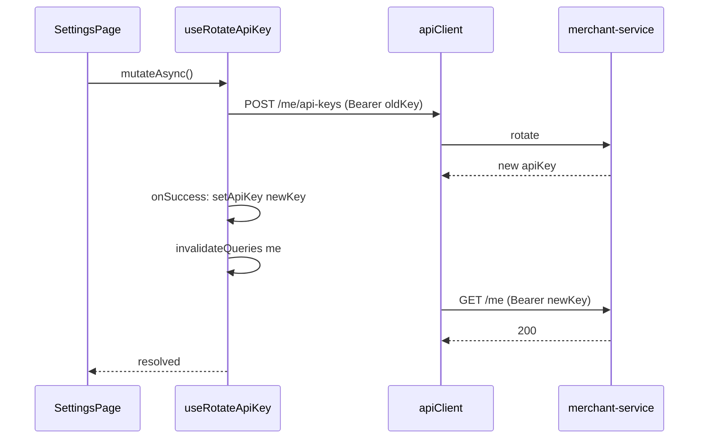

# Fix API key rotation and related log findings

## Root cause (rotation)

[`useRotateApiKey`](frontend/src/hooks/useMerchant.ts) registers `onSuccess` that calls `invalidateQueries` for `merchantKeys.me`. TanStack Query runs mutation `onSuccess` **before** the `mutateAsync()` promise resolves to the caller in [`SettingsPage`](frontend/src/pages/SettingsPage.tsx).

Sequence today:

1. `POST /v1/merchants/me/api-keys` completes; server **invalidates the old key** immediately ([`MerchantApplicationService.rotateApiKey`](backend/merchant-service/src/main/java/com/payflow/merchant/application/MerchantApplicationService.java)).
2. Hook `onSuccess` runs → `invalidateQueries` → refetch `getMerchantMe` runs with **still-old** `apiKey` from [`useAuthStore`](frontend/src/stores/auth-store.ts) (interceptor in [`api-client.ts`](frontend/src/services/api-client.ts) reads `useAuthStore.getState().apiKey` per request).
3. **401** `invalid_api_key`.
4. Only then does `await rotateMut.mutateAsync()` resolve and [`SettingsPage`](frontend/src/pages/SettingsPage.tsx) runs `setApiKey(res.apiKey)`; the next refetch succeeds (**200**).

**Proof**

- Nginx (your terminal): `POST /api/v1/merchants/me/api-keys` **200**, then `GET /api/v1/merchants/me` **401**, then **200** on the same page (`Referer: …/settings`).
- [`pf_err.log`](file:///Users/oscarlima/Downloads/pf_err.log): stack shows `invalidateQueries` → `onSuccess` → `GET …/merchants/me` **401** (lines 117–122).
- [`pf_err.har`](file:///Users/oscarlima/Downloads/pf_err.har): after `…/api-keys`, a `…/merchants/me` response body includes `invalid_api_key` / `Unknown API key` (grep hit around the rotation entries).

## Recommended code change

**Single place:** In [`useRotateApiKey`](frontend/src/hooks/useMerchant.ts), in `onSuccess`, receive the parsed mutation result and:

1. `useAuthStore.getState().setApiKey(data.apiKey)` (or whatever field name [`rotateApiKeyResponseSchema`](frontend/src/types/merchant.ts) uses).
2. Then `void qc.invalidateQueries({ queryKey: merchantKeys.me })`.

Because the axios interceptor reads the store **on each outgoing request**, step 1 guarantees the refetch from step 2 sends the **new** Bearer token.

In [`SettingsPage`](frontend/src/pages/SettingsPage.tsx) rotate handler, **remove** the redundant `setApiKey(res.apiKey)` after `mutateAsync` (the hook now owns persistence for this path), or keep it only if you prefer belt-and-suspenders; one path avoids drift.

**Tests:** Extend or add a focused test if you already test hooks or `api-client` + store behavior; at minimum manually verify: click Rotate → Network shows **no** 401 on the first `GET /merchants/me` after `POST …/api-keys`, or only expected errors.

**Optional consistency:** [`useRegisterMerchant`](frontend/src/hooks/useMerchant.ts) also invalidates `merchant/me` in `onSuccess` before [`SettingsPage`](frontend/src/pages/SettingsPage.tsx) calls `setApiKey(res.apiKey)`. If `isAuthed` was true with a **wrong** key, you can get the same class of spurious 401. Same fix pattern: set store from `onSuccess` data **before** `invalidateQueries`, or drop invalidation from the hook and invalidate only from the page **after** `setApiKey`. Lower priority if you only care about rotation.

---

## Other evident issues (with proof)

| Issue | Proof | Notes |
|-------|--------|--------|
| **Payments UI fails on 200** | HAR responses include `"clientSecret":null` on list items (e.g. `pf_err.har` grep on `/api/v1/payments` bodies); [`paymentResponseSchema`](frontend/src/types/payment.ts) uses `clientSecret: z.string().optional()` which allows missing/undefined but **not** `null`. | Separate from rotation; explains “Could not load payments” when nginx logs **200**. Fix: `z.string().nullable().optional()` or omit `clientSecret` in list DTOs in payment-service. |
| **Recharts console warning** | [`pf_err.log`](file:///Users/oscarlima/Downloads/pf_err.log) lines 1–4: width/height -1. | Layout / first paint; noise, not auth. |
| **Chrome DOM hint** | `pf_err.log`: “Password field is not contained in a form” for `#apiKey`. | Accessibility / autofill hint; wrap field in `<form>` or accept as low priority. |
| **`GET /merchants/me` 401, referer `-`** | Terminal: `GET /api/v1/merchants/me` **401** with `"-"` referer (e.g. ~18:58:43 in your log). | Browser navigation to the API URL sends **no** `Authorization` header; expected, not a backend bug. |
| **Kafka “Node -1 disconnected”** | `payment-service` log after producer init. | Common idle/metadata behavior in local Kafka; not tied to rotation unless you see send failures. |

---

## Flow after fix (mermaid)

